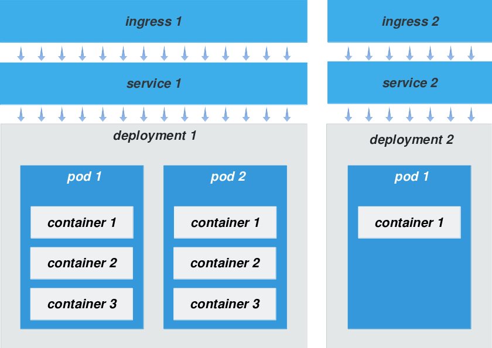
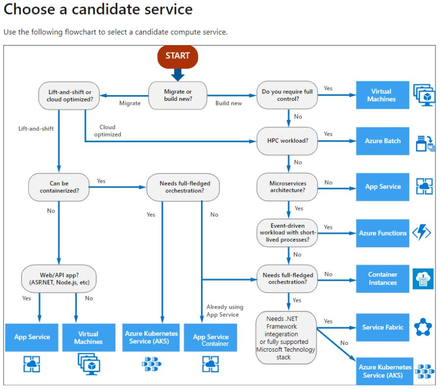
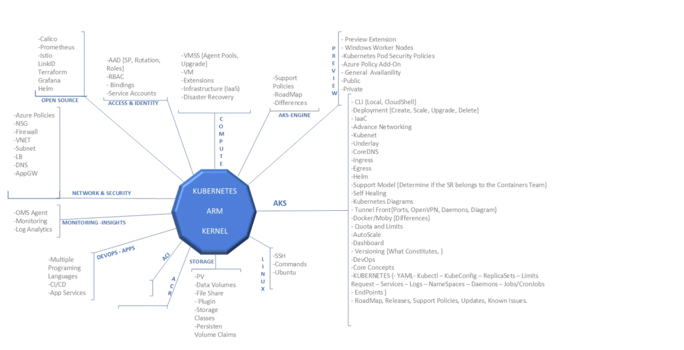
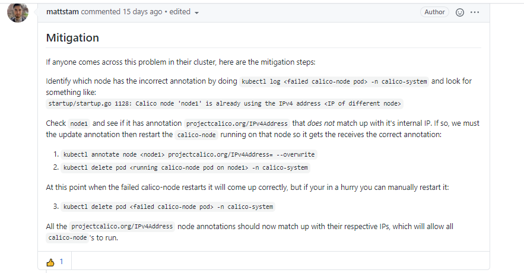
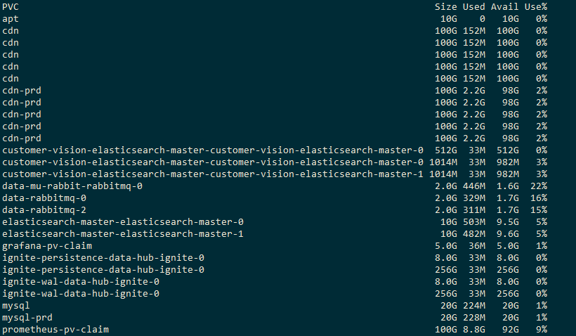
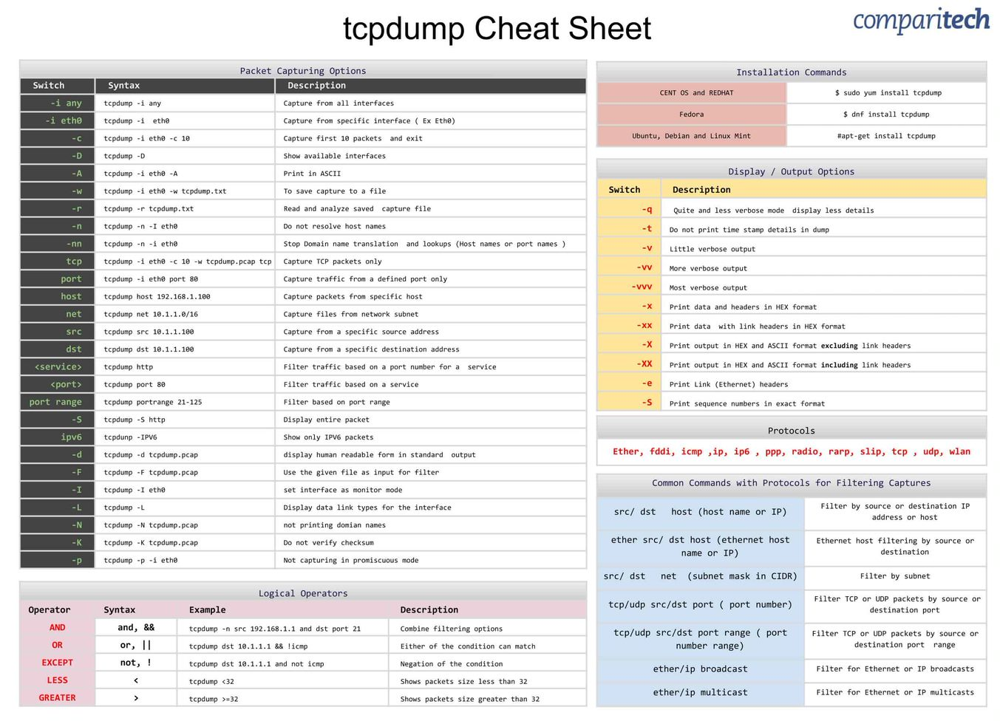
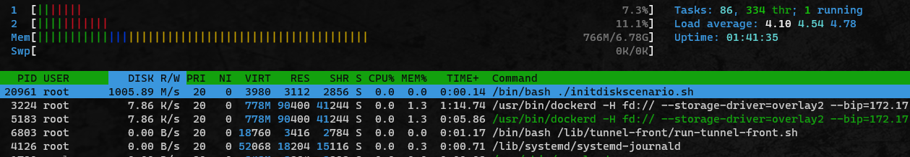
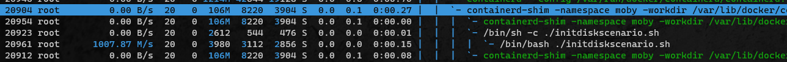
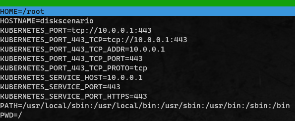
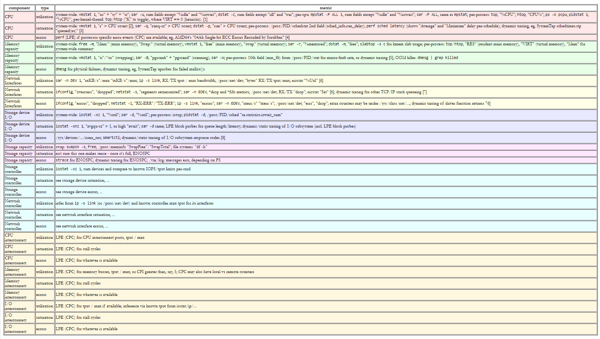

# Kubernetes Documentation Page

> **Kubernetes** is a platform created for the management of container applications

## What is kubernetes?

Kubernetes (K8s) is an open-source system for automating deployment,
scaling, and management of containerized applications. It groups
containers that make up an application into logical units for easy
management and discovery. Kubernetes builds upon 15 years of experience
of running production workloads at Google, combined with best-of-breed
ideas and practices from the community.

**Planet Scale**: Designed on the same principles that allows Google to
run billions of containers a week, Kubernetes can scale without
increasing your ops team.

**Never Outgrow**: Whether testing locally or running a global
enterprise, Kubernetes flexibility grows with you to deliver your
applications consistently and easily no matter how complex your need is.

**Run Anywhere**: Kubernetes is open source giving you the freedom to
take advantage of on-premises, hybrid, or public cloud infrastructure,
letting you effortlessly move workloads to where it matters to you.

## How does kubernetes works?

**Kubernetes** as several components working at the same time. Some of
the components worth noticing are:

-   ***containers***

-   ***pods***

-   ***deployments***

-   ***services***

-   ***ingressess***

The image below, shows how all this components interact with each other



We will now explain all the components in detail.

> **Note**
>
> There are other components not referenced here. HPA can be used to
> autoscale deployments. There are jobs, cronjobs, daemonsets, etc..

### Containers

**Container** is the most basic component in a kubernetes cluster. The
**container** as the application itself. It’s made to run in a
**docker** environment and is isolated from other containers running in
the same node.

**Containers** can range from a fully running application server we want
to continually run and monitor to a simple batch job we intend to run
only once.

**Containers** have their own operative system so they can run in any
node with **docker** installed.

> **Note**
>
> It’s important to note an application might use several containers

### Pods

**Pod** is an aggregation unit and the first component in a kubernetes
structure. **Applications** might have one or more **containers** and
those closely coupled **containers** are placed under the same **pod**.

**Containers** inside a **pod** can see each other *(like docker
containers in the same network)* and share the same resources. **Pods**
can have limited resources and run in isolation so they wont affect
other pods.

**Pods** can run for just a few moments (batch jobs, cron jobs, etc..)
or stay up (server) until it’s requested to go down.

**Pods** can be run directly without a deployment.

### Deployments

**Deployment** is another aggregation unit that controls where pods run
inside the cluster. **Deployments** can have one or more **pods**.
**Deployments** controls the amount of replicas of the same **pod**.

With a **deployment** you can choose the amount of replicas for a
certain **pod** to be ran on the cluster. We can choose the affinity of
the **pods** for certain nodes (**pods** prefer to be ran with high
affinity nodes).

**Deployments** will restart any **pod** that fails, they respect a
predefined redeploy order and can maintain a maximum availability.

### Services

**Services** expose the **containers** inside the **pods** of a specific
deployment. Those services can expose the services internally (ex:
**ClusterIP**) or externally (ex: **NodePort**). Applications on the
cluster can access other deployments by using the service name/ip and
the exposed port.

### Ingresses

**Ingress** is one way to expose a **deployment** outside of the
cluster. It uses a **service** exposed internally using **ClusterIP**
and exposes it externally on a specific endpoint.

The **ingress** used by default is the nginx-ingress wich is a L7 load
balancer that balances load to the **service** inside the cluster


## Choose a candidate (Azure)



## Kubernetes ARM Kernel



## Private Cluster DNS options

- System (the default option): AKS creates a Private DNS Zone in the Node Resource Group; any virtual network that is linked to that Private DNS Zone can resolve the name; the virtual network used by AKS is automatically linked to the Private DNS Zone. <br>

- None: default to public DNS; AKS creates a name for your cluster in a public DNS zone that resolves to the private IP address. <br>

- Custom Private DNS Zone: AKS uses a Private DNS Zone that you or another team has created beforehand; this is mostly used in enterprise scenarios when the Private DNS Zones are integrated with custom DNS servers (e.g., on AD domain controllers, Infoblox, …). <br>

With the custom DNS option, you cannot use any name you like. The Private DNS Zone has to be like: privatelink.<region>.azmk8s.io. For instance, if you deploy your AKS cluster in West Europe, the Private DNS Zone’s name should be privatelink.westeurope.azmk8s.io. There is an option to use a subdomain as well.<br>

When you use the custom DNS option, you also need to use a user-assigned Managed Identity for the AKS control plane. To make the registration of the A record in the Private DNS Zone work, in addition to linking the Private DNS Zone to the virtual network, the managed identity needs the following roles (at least):<br>

- Private DNS Zone Contributor role on the Private DNS Zone <br>
	
- Network Contributor role on the virtual network used by AKS
	
To deploy a private AKS cluster with a custom Private DNS Zone, you can use the following Azure CLI command which also sets the network plugin to azure (as an example). Private cluster also works with kubenet if you prefer that model.
```
az aks create --resource-group RGNAME --name aks-private --network-plugin azure --vnet-subnet-id "resourceId of AKS subnet" --docker-bridge-address 172.17.0.1/16 --dns-service-ip 10.3.0.10 --service-cidr 10.3.0.0/24 --enable-managed-identity --assign-identity "resourceId of user-assigned managed identity" --enable-private-cluster --load-balancer-sku standard --private-dns-zone "resourceId of Private DNS Zone"
```

## Azure CNI
When using Azure CNI, Every pod is assigned a VNET route-able private IP from the subnet. So, Gateway should be able reach the pods directly.<br>

## Kubenet
When using Kubenet mode, Only nodes receive an IP address from subnet. Pod are assigned IP addresses from the PodIPCidr and a route table is created by AKS.<br>
This route table helps the packets destined for a POD IP reach the node which is hosting the pod.<br>

## Kubernetes Cheat Sheet

## Autocomplete

__Kubectl Autocomplete:__
```
source <(kubectl completion bash) 
```
__To add it to your bash shell permanently:__
```
echo "source <(kubectl completion bash)" >> ~/.bashrc
```

## Kubectl Config and Contexts
__Configuration:__
```
kubectl config view 
```
__Export KUBECONFIG var pointing to another kubeconfig file in order to use multiple files:__
```
export KUBECONFIG=~/.kube/config:~/.kube/kubconfig2 
kubectl config view
```

__Get password for user e2e:__
```
kubectl config view -o jsonpath='{.users[?(@.name == "e2e")].user.password}'
```
```
kubectl config view -o jsonpath='{.users[].name}'    # get first user
kubectl config view -o jsonpath='{.users[*].name}'   # get list of users
kubectl config get-contexts                          # get list of contexts
kubectl config current-context                       # get current context 
kubectl config use-context my-cluster-name           # use my-cluster-name as current context
```

__Add new cluster to kubeconfig file that supports basic authentication:__
```
kubectl config set-credentials kubeuser/foo.kubernetes.com --username=kubeuser --password=kubepassword
```
__Get ca -certificate:__
```
 kubectl config view --minify --raw --output 'jsonpath={..cluster.certificate-authority-data}'
(..)h1Y1NHSEljYS9zcGpxc0ZsZTNnM3NZeWRRTjltUHJDZ0ZzSXQKNVE1S0I1UzYxS0VnTHJnTDNPd2FT(--)
```
__Using vmss az command:__
```
az vmss run-command invoke -g MC_(..) -n vmss-name-vmss --instance-id 0 --command-id RunShellScript --query 'value[0].message' -otsv --scripts "openssl x509 -in /etc/kubernetes/certs/apiserver.crt -noout -enddate"
```
__Get cluster certificate in cer format:__
```
kubectl config view --minify --raw --output 'jsonpath={..cluster.certificate-authority-data}' | base64 -D | openssl x509 -text -out -

-----BEGIN CERTIFICATE-----
MIIFMjCCAxqgAwIBAgIQSrgQdZFOuaRNd0Q95JmU2TANBgkqhkiG9w0BAQsFADAZ
MRcwFQYDVQQDEw5HcnVwb0NHRFJvb3RDQTAeFw0wOTA0MDgxNDU0MjBaFw0zNjA1
(...)
-----END CERTIFICATE-----
```
__Get cluster certificates validity:__
```
kubectl config view --raw -o jsonpath="{.clusters[?(@.name == 'myAKSCluster')].cluster.certificate-authority-data}" | base64 -d | openssl x509 -text | grep -A2 Validity
```
__Get Certificate details:__
```
echo | openssl s_client -connect FQDN:443 |openssl x509 -inform pem -noout -text
echo | openssl s_client -servername kubernetes -connect FQDN:443 2>/dev/null | openssl x509 -text
curl --insecure -vvI https://FQDN:443 2>&1 | awk 'BEGIN { cert=0 } /^\* SSL connection/ { cert=1 } /^\*/ { if (cert) print }'
```

__Set a context with a different namespace:__
```
kubectl config get-contexts
kubectl config set-context --current --namespace=kube-system
kubectl config get-contexts
kubectl config set-context --current --namespace=default # go back to default context
kubectl api-resources # list the available short names for the k8s objects

```

## Cluster Resources <br>
__Check Resources:__
```
kubectl get services                         
kubectl get pods --all-namespaces             
kubectl get pods -o wide                       
kubectl get deployment my-dep               
kubectl get pods                            
kubectl get pod my-pod -o yaml             
```
__Get cluster current cluster resources as bash alias__
```
alias util='kubectl get nodes --no-headers | awk '\''{print $1}'\'' | xargs -I {} sh -c '\''echo {} ; kubectl describe node {} | grep Allocated -A 5 | grep -ve Event -ve Allocated -ve percent -ve -- ; echo '\'''
# Get CPU request total (we x20 because because each m3.large has 2 vcpus (2000m) )
alias cpualloc='util | grep % | awk '\''{print $1}'\'' | awk '\''{ sum += $1 } END { if (NR > 0) { print sum/(NR*20), "%\n" } }'\'''
# # Get mem request total (we x75 because because each m3.large has 7.5G ram )
alias memalloc='util | grep % | awk '\''{print $5}'\'' | awk '\''{ sum += $1 } END { if (NR > 0) { print sum/(NR*75), "%\n" } }'\'''
```
__Get Cluster used resources:__
```
kubectl get nodes --no-headers | awk '{print $1}' | xargs -I {} ; kubectl describe node  | sed -r '/Allocated resources:|Addresses:/!d;s//&\n/;s/.*\n//;:a;/Events:|Capacity:/bb;$!{n;ba};:b;s//\n&/;P;D' | sed 's/  //g'
```
__Get node current using resources:__
```
kubectl describe node <instance_node> | sed -r '/Allocated resources:|Addresses:/!d;s//&\n/;s/.*\n//;:a;/Events:|Capacity:/bb;$!{n;ba};:b;s//\n&/;P;D' | sed 's/  //g'
```
```
kubectl api-resources --namespaced=true      # Every resources with namespace
kubectl api-resources --namespaced=false     # Every resources withouth namespace
kubectl api-resources -o name                # Get resources with name
kubectl api-resources -o wide                # Get resources wide 
kubectl api-resources --verbs=list,get       # Get resources that suport verbs list and get
kubectl api-resources --api-group=extensions # Get resources of api-group equals extensions
```
__Get ExternalIPs of every node:__
```
kubectl get nodes -o jsonpath='{.items[*].status.addresses[?(@.type=="ExternalIP")].address}'
```
__Check the status of the node images:__
```
kubectl get nodes -o jsonpath='{range .items[*]}{.metadata.name}{"\t"}{.metadata.labels.kubernetes\.azure\.com\/node-image-version}{"\n"}{end}'
```
__Upgrade node image:__
```
az aks nodepool show --resource-group myResourceGroup --cluster-name myAKSCluster --name mynodepool --query nodeImageVersion
az aks nodepool get-upgrades --nodepool-name mynodepool --cluster-name myAKSCluster --resource-group myResourceGroup
az aks nodepool upgrade --resource-group myResourceGroup --cluster-name myAKSCluster --name mynodepool --node-image-only
```
__Upgrade all node pools:__
```
az aks upgrade --resource-group myResourceGroup --name myAKSCluster --node-image-only
```
__Chek where nodes are deployed according to the Availability Zone:__
```
kubectl get nodes -o custom-columns=NAME:'{.metadata.name}',REGION:'{.metadata.labels.topology\.kubernetes\.io/region}',ZONE:'{metadata.labels.topology\.kubernetes\.io/zone}'
```
## Namespaces and Pods

```
kubectl get namespace # list, describe, create and view a namespaces
kubectl describe namespace default
kubectl get namespace kube-system -o yaml
kubectl run test-pod1 --image=centos --restart=Never -- sleep 500 # create a pod
kubectl get po -o wide
kubectl describe po test-pod1
kubectl get pods -v=8 2>&1 --all-namespaces | tee /tmp/get-token.out
kubectl get pods -n kube-system -o wide --show-labels
kubectl get pods  kube-apiserver-master-01 -n  kube-system -o jsonpath='{.spec.containers[*].name}*' # get containers inside a pod
```
__Execute bash inside a pod:__
```
kubectl -n rook-ceph exec -it $(kubectl -n rook-ceph get pod -l "app=rook-ceph-tools" -o jsonpath='{.items[0].metadata.name}') bash
kubectl exec -i --tty <pod_name> -n <namespace> -- /bin/bash
kubectl exec tunnelfront-(..) -n kube-system -it sh
```
__Execute a pod with postgres client that will try to access an external postgresql database:__
```
kubectl run postgresql-postgresql-client --rm --tty -i --restart='Never' --namespace default --image bitnami/postgresql --env="PGPASSWORD=<HERE_YOUR_PASSWORD>" --command -- psql --host <HERE_HOSTNAME=SVC_OR_IP> -U <HERE_USERNAME> 
```
__Get pods running on specific node:__
```
kubectl get pods --all-namespaces -o wide --field-selector spec.nodeName=aks-usernpool-10999373(..)
```
__Run pod on a specif node:__
```
kubectl run tmp-shell --rm -i --tty --overrides='{"spec": { "template": { "spec": { "nodeSelector": { "kubernetes.io/hostname": "aks-nodepool1-(.....)-vmss"}}}}}' --image nicolaka/netshoot -- /bin/bash
```
__Get pods requests and limits:__
```
kubectl get pods -o custom-columns=NAME:.metadata.name,LIMIT-CPU:.spec.containers[].resources.limits.cpu,REQUEST-CPU:.spec.containers[].resources.requests.cpu,LIMIT-MEM:.spec.containers[].resources.limits.memory,REQUEST-MEM:.spec.containers[].resources.requests.mem
```
or:
```
kubectl get pods -n <namespace> -o=jsonpath='{range .items[*]}{.metadata.namespace}{"\t"}{.metadata.name}{"\t"}{"CPU_Limit:"}{.spec.containers[].resources.limits.cpu}{"\t"}{"Memory_Limit:"}{.spec.containers[].resources.limits.memory}{"\t"}{"CPU_Request:"}{.spec.containers[].resources.requests.cpu}{"\t"}{"Memory_Request:"}{.spec.containers[].resources.requests.memory}{"\n"}{"\n"}{end}'
```
__Delete pod that is stuck on upgrading:__
```
kubectl delete pods pod_name --grace-period=0 –force --namespace <NAMESPACE>
```
__List pods classified by pod restarts__
```
kubectl get pods --sort-by='.status.containerStatuses[0].restartCount'
```
__Get label version of every pod with label app=cassandra:__
```
kubectl get pods --selector=app=cassandra -o jsonpath='{.items[*].metadata.labels.version}'
```
__Get every pod being executed on default namespace:__
```
kubectl get pods --field-selector=status.phase=Running
```
__Check the controlled description of the pod:__
```
kubectl get pods --no-headers=true | awk '{print $1}' | xargs -l bash -c 'kubectl describe pod $0 | grep -i controlled'
```

__Get Logs:__
```
kubectl logs my-pod                                 # Get pod logs
kubectl logs -l name=myLabel                        # Get pod logs with label=mylabel
kubectl logs my-pod --previous                      # Get pod logs from the previous instance
kubectl logs my-pod -c my-container                 # Get logs of specific container inside a pod
kubectl logs -l name=myLabel -c my-container        # Get container logs of a pod label
kubectl run nginx --image=nginx --restart=Never -n  # Execute pod in a specific namespace
mynamespace   
# Display only the most recent 20 lines of output in pod nginx
kubectl logs --tail=20 nginx

# Show all logs from pod nginx written in the last hour
kubectl logs --since=1h nginx
```
__Get Events:__
```
kubectl get events --field-selector involvedObject.kind!=Pod
kubectl get events –field-selector type=Warning
```

__Get pod logs inside the node:__
```
find /var/log/pods -type f -name "*.log" | xargs cat | sort | uniq --count --repeated
```


__Docker get the size of the overlay mounts used:__
```
sudo docker inspect $(docker ps -qa) |  jq -r 'map([.Name, .GraphDriver.Data.UpperDir]) | .[] | "\(.[0])\t\(.[1])"' | awk -F '/diff' '{print $1}' | awk '{printf $1" "}''{system("sudo du -sh " $2)}' | sort -rhk2
```
## Patching resources
```
# Partially update a node
kubectl patch node k8s-node-1 -p '{"spec":{"unschedulable":true}}'

# Update a container's image; spec.containers[*].name is required because it's a merge key
kubectl patch pod valid-pod -p '{"spec":{"containers":[{"name":"kubernetes-serve-hostname","image":"new image"}]}}'

# Update a container's image using a json patch with positional arrays
kubectl patch pod valid-pod --type='json' -p='[{"op": "replace", "path": "/spec/containers/0/image", "value":"new image"}]'

# Disable a deployment livenessProbe using a json patch with positional arrays
kubectl patch deployment valid-deployment  --type json   -p='[{"op": "remove", "path": "/spec/template/spec/containers/0/livenessProbe"}]'

# Add a new element to a positional array
kubectl patch sa default --type='json' -p='[{"op": "add", "path": "/secrets/1", "value": {"name": "whatever" } }]
```
__Get node annotations:__<br>
```
kubectl get node xx -o yaml > nodexx.yaml
Kubectl annotate node xx--overwrite flannel.alpha.coreos.com/public-ip=new-value
kubectl patch node xx -p '{"metadata":{"annotations":{"flannel.alpha.coreos.com/public-ip":"new-value"}}}'
```
### Project Calico - Calico pod keeps restarting after upgrade to AKS 1.20.7 <br>
[Calico-Github-Issue](https://github.com/projectcalico/calico/issues/4611 "Calico Github Issue")<br>


## Secrets:

__decrypt a secret:__
```
kubectl get secret default-token-cfz78 -o jsonpath="{['data']['ca\.crt']}" | base64 --decode
kubectl -n log patch serviceaccount default -p ' {"imagePullsecrets": [{"name":"registry-harbor"}]}'
```
```
kubectl get secret registry-harbor -n log -o jsonpath="{['data']['\.dockerconfigjson']}"
ewoJImF1dGhzIjogewoJCSJodHRwczovL2luZGV4LmRvY2tlci5pby92MS8iOiB7CgkJCSJhdXRoIjogImRHMWpiVzA2VDNaMmVXdGtkRGsxTmpJaCIKCQl9LAoJCSJsZGM2MDAxYXBzNDUuZ3J1cG9jZ2QuY29tOjgwNjAiOiB7CgkJCSJhdXRoIjogIllXUnRhVzQ2U0dGeVltOXlNVEl6TkRVPSIKCQl9LAoJCSJscGM2MDAxYXBzMjEuZ3J1cG9jZ2QuY29tOjgwODAiOiB7CgkJCSJhdXRoIjogIll6QTRNak16TVRwbmNtbDZlbXhaTnpnNSIKCQl9LAoJCSJuZXh1cy5ncnVwb2NnZC5jb206ODQ0MyI6IHsKCQkJImF1dGgiOi(....)
```

__Create secret based on a file:__
```
kubectl create secret generic -n log security-roles --from-file=roles.yml
```

__List every secret in use by a pod:__
```
kubectl get pods -o json | jq '.items[].spec.containers[].env[]?.valueFrom.secretKeyRef.name' | grep -v null | sort | uniq
```

## Deamon sets and labels:

```
kubectl get ds -A # list all the deamonsets in the cluster
kubectl -n kube-system get ds kube-proxy -o yaml # view the kube-proxy deamonset yaml
kubectl get po -l k8s-app=kube-proxy -A -o wide # list kube-proxy pods using label
kubectl get po --show-labels -n new-ns1 # list labels from new-ns1
kubectl -n new-ns1 label po webpod1 test=bleu # label the webpod1 with test=blue
kubectl -n new-ns1 describe po webpod1 | grep ^Labels: # check webpod1 labels
kubectl -n new-ns1 label po webpod1 test=blue --overwrite # update the label
kubectl get po -l test=blue --show-labels -A # check the label again
kubectl -n new-ns1 label po webpod1 test- # remove the test=blue label
kubectl get po -l test=blue --show-labels -A
```
__Get Labels:__
```
kubectl get nodes --show-labels
```
__Create label and atribute to a node:__
```
kubectl label nodes <your-node-name> node_type=worker
```
__Remove Label:__
```
 kubectl label node <node> <label>-
```

## Sample web deployment, scale and rollout
```
# create an nginx deployment with version with image 1.7.9
cat <<EOF | kubectl apply -f -
apiVersion: apps/v1
kind: Deployment
metadata:
  name: web-deploy1
  labels:
    app: nginx-deploy
spec:
  replicas: 2
  selector:
    matchLabels:
      app: nginx1
  template:
    metadata:
      labels:
        app: nginx1
    spec:
      containers:
      - name: nginx
        image: nginx:1.7.9
        ports:
        - containerPort: 80
EOF
```
```
kubectl get deploy --show-labels # list the deployment and the pods
kubectl get po --show-labels
kubectl scale --replicas=0 deploy web-deploy1 # scale the deployment to zero pods
kubectl describe deploy web-deploy1 # describe the deployment
kubectl edit deploy web-deploy1 # scale it to 5 using kubectl edit 
#(it will open vi on a yaml, just update the line with "replicas: 0" to "replicas: 5")
# Update the image in the deployment to nginx:1.9.1 using a rolling update
kubectl set image deployment web-deploy1 nginx=ngixn:1.9.1
kubectl get po -l app=nginx1 # check the web-deploy1 pods
# double oops, something is wrong!
kubectl describe po $(kubectl get po --field-selector=status.phase!=Running | tail -1 | cut -d " " -f1) # describe one of the not ready pods to see what is going on
kubectl rollout history deployment/web-deploy1 # grrrrr!!! we have a typo in the image name. we have to go back!!!
kubectl rollout undo deployment/web-deploy1 --to-revision=1
kubectl get po -l app=nginx1 # are we good now?
kubectl set image deployment web-deploy1 nginx=nginx:1.9.1 # we still have to update the image version
kubectl get po -l app=nginx1 # all good now
```

## Services, endpoints, clusterip and nodeports
In some scenarios when we update a deployment the pods will get recreated with a new dynamic IP. How can we have a known IP to reach our application? Enter the service. <br>
```
kubectl get svc -A # list services in the cluster
kubectl describe po kube-apiserver-masternode1 -n kube-system
kubectl describe svc kube-dns -n kube-system # describe the kube-dns service
kubectl get po -l k8s-app=kube-dns -A -o wide # check coredns pods IPs
## Alter SVC ExternalIP
kubectl patch svc lb-service  -p '{"spec": {"type": "LoadBalancer", "externalIPs":["20.72.122.190"]}}'


# endpoints match the coredns pods IPs
kubectl expose deployment web-deploy1 --name web-deploy1-svc --type=NodePort --target-port=80 # create a service for the web-deploy1 deployment
kubectl expose deployment web-deploy1 --name web-deploy1-svc --type=NodePort --target-port=80 --dry-run -o yaml # can we see the yaml for what we just did? sure
kubectl get svc -A # list services again
NODEPORT=$(kubectl get svc web-deploy1-svc | grep 80: | awk '{print $5}' | cut -d":" -f2 | sed 's|/TCP||') # try curl to one of the nodes using the high number port that is showing next to 80
# curl the nodeport
curl workernode2:${NODEPORT} # now we can reach our app from outside the cluster using the nodeport
```
__List services classified by name:__
``` 
kubectl get services --sort-by=.metadata.name
```

__Get all Kubernetes LB external IPs:__
```
kubectl get services --all-namespaces -o json | jq -r '.items[] | { name: .metadata.name, ns: .metadata.namespace, ip: .status.loadBalancer?|.ingress[]?|.ip  }'
{
  "name": "azureml-fe",
  "ns": "default",
  "ip": "20.56.xxx.xxx"
}
```
## Networking:

__Service port-forward:__
```
Kubectl port-forward svc/argocd-server -n argocd 8083:80
```
__Curl command time:__
```
for ((i = 0; i < 10; i++)); do curl -o /dev/null -s "www.microsoft.com" -w "Connect %{time_connect}s, Start Transfer %{time_starttransfer}s Total %{time_total}s\n"; done

alias curldns='curl -w "n\dnslookup: %{time_namelookup} | connect: %{time_connect} | appconnect: %{time_appconnect} | pretransfer: %{time_pretransfer} | redirect: %{time_redirect} | starttransfer: %{time_starttransfer} | total: %{time_total} | size: %{size_download}\n"'
```

### Permissions:

__All accounts get cluster admin temporary:__
```
Kubectl create clusterrolebinding all-serviceaccounts-admin-temp --clusterrole=cluster-admin --group=system:serviceaccounts
```

### Namespace won't get deleted:
```
Kubectl delete –force –grace-period 0 –ns <namespace_name>
```
If namespace doesn't get delete you can check if the resource as any pending pods:

```
kubectl api-resources --verbs=list --namespaced -o name   | xargs -n 1 kubectl get --show-kind --ignore-not-found -n <namespace_name>
```

Put finalizers string empy:
```
kubectl get namespace <namespace> -o json | jq '.spec = {"finalizers":[]}' > temp.json
```

Using curl to send this finalizers string file to the namespace:
[bearer-token-azure](https://social.technet.microsoft.com/wiki/contents/articles/53488.azure-rest-api-how-to-create-bearer-token.aspx "Bearer Token")
Using bearer token:<br>

```
kubectl config view --minify | grep server | cut -f 2- -d ":" | tr -d " "
KUBEAPI=https://aks-11814-rg-aks-11814-(...)f72f.hcp.westeurope.azmk8s.io:443
token=$(az account get-access-token --resource https://management.azure.com/ --query accessToken -o tsv)
curl -k -s $KUBEAPI/<namespace>/ -H 'Authorization: Bearer ${token}'
```
Use curl to POST it in the namespace:<br>
```
curl -k -H "Content-Type: application/json" -X PUT --data-binary @temp.json $KUBEAPI/opa/finalize -H 'Authorization: Bearer token-9wk2z:lwqlng8jt8fddd79x7mdhkd7x754wdx4rnjsldwxr7q2chtrkc7g6m'
```
Without bearer token:<br>
```
kubectl get namespaces $NAMESPACE -o json | jq '.spec.finalizers=[]' > /tmp/ns.json
kubectl proxy & curl -k -H "Content-Type: application/json" -X PUT --data-binary @/tmp/ns.json http://127.0.0.1:8001/api/v1/namespaces/$NAMESPACE/finalize
```
!!! note "Note"
	__Using kube api server Raw all in once__
```
 NAMESPACE=<your-namespace>
    kubectl get namespace $NAMESPACE -o json | tr -d "\n" | sed "s/\"finalizers\": \[[^]]\+\]/\"finalizers\": []/" | kubectl replace --raw /api/v1/namespaces/$NAMESPACE/finalize -f -
```
__Delete things using curl__:
```
curl -H "Authorization: Bearer ${token}" -X DELETE https://management.azure.com/subscriptions/${subscriptionId}/resourceGroups/${resourceGroupName}/providers/Microsoft.Network/virtualNetworks/${virtualNetworkName}/subnets/${subnetName}/providers/Microsoft.ContainerInstance/serviceAssociationLinks/default?api-version=2018-10-01

curl -H "Authorization: Bearer ${token}" -X DELETE https://management.azure.com/subscriptions/${subscriptionId}/resourceGroups/${resourceGroupName}/providers/Microsoft.Network/networkProfiles/${networkProfileName}?api-version=2020-05-01
```

### Get PVC usage using curl

__List PersistentVolumes classified by capacity__
```
kubectl get pv --sort-by=.spec.capacity.storage
```
__Get Cluster api endpoint server:__
```
kubectl config view --minify | grep server | cut -f 2- -d ":" | tr -d " "
```
__Pass both to the script as:__<br>
```
#!/usr/bin/env bash
#KUBEAPI=
#BEARER='token-fjx4x:lm454tgfq2zgg7574xjkxp(..)'

#curl -k -H "Content-Type: application/json" $KUPEAPI -H 'Authorization: Bearer token-xlzmg:zkscss6r6ctpd9n6p864df822tfd(...)'

function getNodes() {
  curl -s -k $KUBEAPI -H 'Authorization: Bearer '$BEARER'' | jq -r '.items[].metadata.name'
}

function getPVCs() {
  jq -s '[flatten | .[].pods[].volume[]? | select(has("pvcRef")) | '\
'{name: .pvcRef.name, capacityBytes, usedBytes, availableBytes, '\
'percentageUsed: (.usedBytes / .capacityBytes * 100)}] | sort_by(.name)'
}

function column() {
  awk '{ for (i = 1; i <= NF; i++) { d[NR, i] = $i; w[i] = length($i) > w[i] ? length($i) : w[i] } } '\
'END { for (i = 1; i <= NR; i++) { printf("%-*s", w[1], d[i, 1]); for (j = 2; j <= NF; j++ ) { printf("%*s", w[j] + 1, d[i, j]) } print "" } }'
}

function defaultFormat() {
  awk 'BEGIN { print "PVC 1K-blocks Used Available Use%" } '\
'{$2 = $2/1024; $3 = $3/1024; $4 = $4/1024; $5 = sprintf("%.0f%%",$5); print $0}'
}

function humanFormat() {
  awk 'BEGIN { print "PVC Size Used Avail Use%" } '\
'{$5 = sprintf("%.0f%%",$5); printf("%s ", $1); system(sprintf("numfmt --to=iec %s %s %s | sed '\''N;N;s/\\n/ /g'\'' | tr -d \\\\n", $2, $3, $4)); print " " $5 }'
}

function format() {
  jq '.[] | "\(.name) \(.capacityBytes) \(.usedBytes) \(.availableBytes) \(.percentageUsed)"' |
    sed 's/^"\|"$//g' |
    $format | column
}

if [ "$1" == "-h" ]; then
  format=humanFormat
else
  format=defaultFormat
fi

for node in $(getNodes); do
 curl -k -s $KUBEAPI/$node/proxy/stats/summary -H 'Authorization: Bearer '$BEARER''
done | getPVCs | format
```
__bash script you can use:__



## SSH INTO A NODE
__Generate key if you don't have one:__
```
ssh-keygen -m PEM -t rsa -b 4096 -f ~/.ssh/<new-key-name> -C <username>
```
__Distribute the key across the nodes:__
```
NODE_RESOURCE_GROUP=$(az aks show --resource-group Resource_Group --name AKS_Cluster --query nodeResourceGroup -o tsv)
SCALE_SET_NAME=$(az vmss list --resource-group $CLUSTER_RESOURCE_GROUP --query [0].name -o tsv)

settings = "{'username':'azureuser','ssh_key':'$(cat ~/.ssh/id_rsa.pub)'}"
or 
jsonfile
{
	"username" : "azureuser",
	"ssh_key" : "REPLACE_THIS_WITH_CONTENT_OF_ID_RSA_PUB_FILE"
}
az vmss extension set --resource-group $NODE_RESOURCE_GROUP --vmss-name $SCALE_SET_NAME --name VMAccessForLinux --publisher Microsoft.OSTCExtensions --version 1.4 --protected-settings protected_settings.json or $settings
az vmss extension set --resource-group $NODE_RESOURCE_GROUP --vmss-name $SCALE_SET_NAME --name VMAccessForLinux --publisher Microsoft.OSTCExtensions --version 1.4 --protected-settings "{\"username\":\"azureuser\", \"ssh_key\":\"$(cat ~/.ssh/id_rsa.pub)\"}"
az vmss update-instances --instance-ids '*' --name $SCALE_SET_NAME -g $NODE_RESOURCE_GROUP
```
__if availability set:__
```
 az vm user update --resource-group <resource-group-name> --name <instance-name> --username <username> --ssh-key-value ~/.ssh/<new-key-name>.pub
```
[kubectl-node](https://github.com/kvaps/kubectl-node-shell "Node Shell")
```
curl -LO https://github.com/kvaps/kubectl-node-shell/raw/master/kubectl-node_shell
chmod +x ./kubectl-node_shell
sudo mv ./kubectl-node_shell /usr/local/bin/kubectl-node_shell
```
```
# Get standard bash shell
kubectl node-shell <node>
# Execute custom command
kubectl node-shell <node> -- echo 123
# Use stdin
cat /etc/passwd | kubectl node-shell <node> -- sh -c 'cat > /tmp/passwd'
# Run oneliner script
kubectl node-shell <node> -- sh -c 'cat /tmp/passwd; rm -f /tmp/passwd'
```
## Using MSFT debug image
[ssh-into-nodes](https://docs.microsoft.com/en-us/azure/aks/ssh "SSH Key")
```
kubectl get nodes -o wide
```
```
kubectl debug node/aks-nodepool1-12345678-vmss000000 -it --image=mcr.microsoft.com/aks/fundamental/base-ubuntu:v0.0.11
kubectl run -it --rm aks-ssh --image=debian
```
__Instal the openssh client:<br>__
```
apt-get update && apt-get install openssh-client -y

```
__On another shell copy your ssh keys that was created on the cluster creation with the --generate-ssh-keys command to the pod:__<br>
```
kubectl cp ~/.ssh/id_rsa $(kubectl get pod -l run=aks-ssh -o jsonpath='{.items[0].metadata.name}'):/id_rsa
kubectl exec aks-ssh -c aks-ssh chmod 0600 id_rsa
```
```
kubectl get nodes -o json | jq .items[].status.addresses[].address
ssh -i id_rsa username@ipaddress
```

__other images:__<br>
```
kubectl debug node/aks-nodepool1-12345678-vmss000000 -it --image=busybox
kubectl debug node/aks-nodepool1-12345678-vmss000000 -it --image=nicolaka/netshoot
```

__IF WINDOWS:__<br>
```
$ kubectl get pods
NAME                                                    READY   STATUS    RESTARTS   AGE
node-debugger-aks-nodepool1-12345678-vmss000000-bkmmx   1/1     Running   0          21s
```
```
kubectl cp ~/.ssh/id_rsa node-debugger-aks-nodepool1-12345678-vmss000000-bkmmx:/id_rsa
```
```
chmod 0400 id_rsa
```
```
ssh -i id_rsa azureuser@<ip_of_windows_node>
```
## Network troubleshooting
### DNS TROUBLESHOOTING:<br>

[Kubernetes DNS resolution](https://v1-17.docs.kubernetes.io/docs/tasks/administer-cluster/dns-debugging-resolution/ "DNS Resolution")<br>
[Kubernetes DNS custom](https://docs.microsoft.com/en-us/azure/aks/coredns-custom "DNS Custom configuration")<br>

__From cluster:__<br>
```
kubectl get pods --namespace=kube-system -l k8s-app=kube-dns # Check if the DNS pod is running
for p in $(kubectl get pods --namespace=kube-system -l k8s-app=kube-dns -o name); do kubectl logs --namespace=kube-system $p; done # Check for Errors in the DNS pod
kubectl logs --namespace=kube-system -l k8s-app=kube-dns
kubectl get configmaps --namespace=kube-system coredns-custom -o yaml
kubectl get configmaps --namespace=kube-system coredns -o yaml
kubectl delete pods -n kube-system -l k8s-app=kube-dns # Restart DNS configuration
kubectl get ep kube-dns --namespace=kube-system # Get dns endpoints
```
We need to log on one of the cluster nodes:<br>
Check if custom DNS IP addresses are set in place on nodes __/etc/resolv.conf__, case not, We need to do a dhcp release/renew inside the node
```
sudo dhclient -r; sudo dhclient
```
Check dns from the windows bastion:<br>
```
tnc fqdn -port 443
```
__From node:__<br>
__Install these tools:__
```
apt-get update && apt install dnsutils -y 
apt-get update && apt-get install iputils-ping -y 
apt-get update && apt-get install curl -y
```
__The command below verifies that a proper record is returned by the DNS server(s) in /etc/resolv.conf:__<br>
```
nslookup microsoft.com
nslookup or dig @ip_of_dns_server domain
nc -vz fqdn 443
curl -vso /dev/null https://fqdn
curl -vso /dev/null https://fqdn-ip
curl -v telnet://fqdn:443
curl -v telnet://fqdnip:443
```
__if no access to the node (using azcli):__<br>
```
az vmss run-command invoke -g MC_ACS-RG-(..) -n aks-(..)-vmss --command-id RunShellScript --instance-id 0 --scripts "nc -vz fqdn 443" -o json
```
__From pod:__<br>
```
kubectl run tmp-shell --restart=Never -i --tty --image nicolaka/netshoot -- /bin/bash
```
__Check for the /etc/resolv.conf inside the pod to see if it was matching the kube-dns upstream server:__<br>
```
kubectl get svc -n kube-system
service/kube-dns                         ClusterIP   10.245.64.10    <none>        53/UDP,53/TCP   23d       k8s-app=kube-dns
```
__inside pod:__
!!!note Note
	10.0.0.10 is by default the ip address of kube-dns service, 10.0.0.10 will forward the query to whatever the dns server in /etc/resolv.conf on the node
```
cat /etc/resolv.conf
nameserver 10.245.64.10 search default.svc.cluster.local svc.cluster.local cluster.local
curl -v telnet://fqdn:443
tcpdump -ni eth0 -w ethcap-%H.pcap -e -C 200 -G 3600 -K OR tcpdump -s 0 -vvv -w /path/nameofthecapture.cap
kubectl cp tmp-shell:/podnode.pcap .
```

### Using tshark inside the node
```
sudo apt update
sudo apt install tshark
sudo tshark -i eth0 -f 'port 80' -Y "http.request.method == "GET" && http contains YO" -T fields -e ip.src -e tcp.srcport -e ip.dst -e tcp.dstport -e ip.proto
```

Param	Purpose:<br>

1. -i eth0	Select the eth0 network interface
2. -f ‘port 80’	This is a filter for tcpdump to just get traffic to port 80
3. -Y “http.request.method == “GET” && http contains YO”	Since we’re grabbing all port 80 traffic we need a way to filter it down to our specific requests. 
There are many ways to do this, but I chose to use the -Y flag to query out all of the GET requests that contain the word ‘YO’
4. -T fields -e ip.src -e tcp.srcport -e ip.dst -e tcp.dstport -e ip.proto	Display the source ip, source port, destination ip, destination port and protocol as output (6=TCP for protocol)

__Use Hey to send packets:__<br>
[hey tool](https://github.com/rakyll/hey "Hey tool")<br>
```
hey -d "YO" -n 10 -c 1 http://20.62.153.212
hey --disable-keepalive -d "YO" -n 10 -c 1 http://20.62.153.212
```

To get network traces from the Pod, you can do the following:<br>
1.	SSH to the node
2.	Run ‘docker ps|grep <pod name>’ and remember the container ID of your application
3.	Run ‘docker inspect <container ID>|grep Pid’
4.	Run ‘nsenter -t <Pid> -n ip addr’ and remember the ifindex number which is ‘if<ifindex>’
5.	Run ‘ip addr|grep ^<ifindex>’ to get the network interface
6.	Run ‘tcpdump -i <network interface> -w /tmp/test.cap’ and start to reproduce your issue
7.	Once done, you could run ‘ctrl + c’ to abort.


If you want to spin up a throw away container for debugging.<br>
```
kubectl run tmp-shell --rm -i --tty --image nicolaka/netshoot  -- /bin/bash
```
And if you want to spin up a container on the host's network namespace.<br>
```
kubectl run tmp-shell --rm -i --tty --overrides='{"spec": {"hostNetwork": true}}' --image nicolaka/netshoot -- /bin/bash
```
Network Problems<br>
Many network issues could result in application performance degradation. Some of those issues could be related to the underlying networking infrastructure(underlay). Others could be related to misconfiguration at the host or Docker level. Let's take a look at common networking issues:<br>

- latency
- routing
- DNS resolution
- firewall
- incomplete ARPs


## iperf 

Purpose: test networking performance between two containers/hosts. 

Create Overlay network:

```
$ docker network create -d overlay perf-test
```
Launch two containers:

```
🐳  → docker service create --name perf-test-a --network perf-test nicolaka/netshoot iperf -s -p 9999
7dkcckjs0g7b4eddv8e5ez9nv


🐳  → docker service create --name perf-test-b --network perf-test nicolaka/netshoot iperf -c perf-test-a -p 9999
2yb6fxls5ezfnav2z93lua8xl


 🐳  → docker service ls
ID            NAME         REPLICAS  IMAGE              COMMAND
2yb6fxls5ezf  perf-test-b  1/1       nicolaka/netshoot  iperf -c perf-test-a -p 9999
7dkcckjs0g7b  perf-test-a  1/1       nicolaka/netshoot  iperf -s -p 9999


🐳  → docker ps
CONTAINER ID        IMAGE                      COMMAND                  CREATED             STATUS              PORTS               NAMES
ce4ff40a5456        nicolaka/netshoot:latest   "iperf -s -p 9999"       31 seconds ago      Up 30 seconds                           perf-test-a.1.bil2mo8inj3r9nyrss1g15qav

🐳  → docker logs ce4ff40a5456
------------------------------------------------------------
Server listening on TCP port 9999
TCP window size: 85.3 KByte (default)
------------------------------------------------------------
[  4] local 10.0.3.3 port 9999 connected with 10.0.3.5 port 35102
[ ID] Interval       Transfer     Bandwidth
[  4]  0.0-10.0 sec  32.7 GBytes  28.1 Gbits/sec
[  5] local 10.0.3.3 port 9999 connected with 10.0.3.5 port 35112

```

## tcpdump

**tcpdump** is a powerful and common packet analyzer that runs under the command line. It allows the user to display TCP/IP and other packets being transmitted or received over an attached network interface. 

```
# Continuing on the iperf example. Let's launch netshoot with perf-test-a's container network namespace.

🐳  → docker run -it --net container:perf-test-a.1.0qlf1kaka0cq38gojf7wcatoa  nicolaka/netshoot 

# Capturing packets on eth0 and tcp port 9999.

/ # tcpdump -i eth0 port 9999 -c 1 -Xvv
tcpdump: listening on eth0, link-type EN10MB (Ethernet), capture size 262144 bytes
23:14:09.771825 IP (tos 0x0, ttl 64, id 60898, offset 0, flags [DF], proto TCP (6), length 64360)
    10.0.3.5.60032 > 0e2ccbf3d608.9999: Flags [.], cksum 0x1563 (incorrect -> 0x895d), seq 222376702:222441010, ack 3545090958, win 221, options [nop,nop,TS val 2488870 ecr 2488869], length 64308
	0x0000:  4500 fb68 ede2 4000 4006 37a5 0a00 0305  E..h..@.@.7.....
	0x0010:  0a00 0303 ea80 270f 0d41 32fe d34d cb8e  ......'..A2..M..
	0x0020:  8010 00dd 1563 0000 0101 080a 0025 fa26  .....c.......%.&
	0x0030:  0025 fa25 0000 0000 0000 0001 0000 270f  .%.%..........'.
	0x0040:  0000 0000 0000 0000 ffff d8f0 3435 3637  ............4567
	0x0050:  3839 3031 3233 3435 3637 3839 3031 3233  8901234567890123
	0x0060:  3435 3637 3839 3031 3233 3435 3637 3839  4567890123456789
	0x0070:  3031 3233 3435 3637 3839 3031 3233 3435  0123456789012345
	0x0080:  3637 3839 3031 3233 3435 3637 3839 3031  6789012345678901
	0x0090:  3233 3435 3637 3839 3031 3233 3435 3637  2345678901234567
	0x00a0:  3839 3031 3233 3435 3637 3839 3031 3233  8901234567890123
	0x00b0:  3435 3637 3839 3031 3233 3435 3637 3839  4567890123456789
	0x00c0:  3031 3233 3435 3637 3839 3031 3233 3435  0123456789012345
	0x00d0:  3637 3839 3031 3233 3435 3637 3839 3031  6789012345678901
	0x00e0:  3233 3435 3637 3839 3031 3233 3435 3637  2345678901234567
	0x00f0:  3839 3031 3233 3435 3637 3839 3031 3233  8901234567890123
	0x0100:  3435 3637 3839 3031 3233 3435 3637 3839  4567890123456789
	
```

More info on `tcpdump` can be found [here](http://www.tcpdump.org/tcpdump_man.html).




## netstat

Purpose: `netstat` is a useful tool for checking your network configuration and activity. 

Continuing on from `iperf` example. Let's use `netstat` to confirm that it's listening on port `9999`. 


```
🐳  → docker run -it --net container:perf-test-a.1.0qlf1kaka0cq38gojf7wcatoa  nicolaka/netshoot 

/ # netstat -tulpn
Active Internet connections (only servers)
Proto Recv-Q Send-Q Local Address           Foreign Address         State       PID/Program name
tcp        0      0 127.0.0.11:46727        0.0.0.0:*               LISTEN      -
tcp        0      0 0.0.0.0:9999            0.0.0.0:*               LISTEN      -
udp        0      0 127.0.0.11:39552        0.0.0.0:*                           -
```

##  nmap
`nmap` ("Network Mapper") is an open source tool for network exploration and security auditing. It is very useful for scanning to see which ports are open between a given set of hosts. This is a common thing to check for when installing Swarm or UCP because a range of ports is required for cluster communication. The command analyzes the connection pathway between the host where `nmap` is running and the given target address.

```
🐳  → docker run -it --privileged nicolaka/netshoot nmap -p 12376-12390 -dd 172.31.24.25

...
Discovered closed port 12388/tcp on 172.31.24.25
Discovered closed port 12379/tcp on 172.31.24.25
Discovered closed port 12389/tcp on 172.31.24.25
Discovered closed port 12376/tcp on 172.31.24.25
...
```
There are several states that ports will be discovered as:

- `open`: the pathway to the port is open and there is an application listening on this port.
- `closed`: the pathway to the port is open but there is no application listening on this port.
- `filtered`: the pathway to the port is closed, blocked by a firewall, routing rules, or host-based rules.

## iftop

Purpose: iftop does for network usage what top does for CPU usage. It listens to network traffic on a named interface and displays a table of current bandwidth usage by pairs of hosts.

Continuing the `iperf` example.

```
 → docker ps
CONTAINER ID        IMAGE                      COMMAND                  CREATED             STATUS              PORTS               NAMES
ce4ff40a5456        nicolaka/netshoot:latest   "iperf -s -p 9999"       5 minutes ago       Up 5 minutes                            perf-test-a.1.bil2mo8inj3r9nyrss1g15qav

🐳  → docker run -it --net container:perf-test-a.1.bil2mo8inj3r9nyrss1g15qav nicolaka/netshoot iftop -i eth0

```

## drill

Purpose: drill is a tool	to designed to get all sorts of information out of the DNS.

Continuing the `iperf` example, we'll use `drill` to understand how services' DNS is resolved in Docker. 

```
🐳  → docker run -it --net container:perf-test-a.1.bil2mo8inj3r9nyrss1g15qav nicolaka/netshoot drill -V 5 perf-test-b
;; ->>HEADER<<- opcode: QUERY, rcode: NOERROR, id: 0
;; flags: rd ; QUERY: 1, ANSWER: 0, AUTHORITY: 0, ADDITIONAL: 0
;; QUESTION SECTION:
;; perf-test-b.	IN	A

;; ANSWER SECTION:

;; AUTHORITY SECTION:

;; ADDITIONAL SECTION:

;; Query time: 0 msec
;; WHEN: Thu Aug 18 02:08:47 2016
;; MSG SIZE  rcvd: 0
;; ->>HEADER<<- opcode: QUERY, rcode: NOERROR, id: 52723
;; flags: qr rd ra ; QUERY: 1, ANSWER: 1, AUTHORITY: 0, ADDITIONAL: 0
;; QUESTION SECTION:
;; perf-test-b.	IN	A

;; ANSWER SECTION:
perf-test-b.	600	IN	A	10.0.3.4 <<<<<<<<<<<<<<<<<<<<<<<<<< Service VIP

;; AUTHORITY SECTION:

;; ADDITIONAL SECTION:

;; Query time: 1 msec
;; SERVER: 127.0.0.11 <<<<<<<<<<<<<<<<<<<<<<<<<<<<<<<<<<<<< Local resolver 
;; WHEN: Thu Aug 18 02:08:47 2016
;; MSG SIZE  rcvd: 56
```

## netcat

Purpose: a simple Unix utility that reads and writes data across network connections, using the TCP or UDP protocol. It's useful for testing and troubleshooting TCP/UDP connections. `netcat` can be used to detect if there's a firewall rule blocking certain ports.

```
🐳  →  docker network create -d overlay my-ovl
55rohpeerwqx8og4n0byr0ehu

🐳  → docker service create --name service-a --network my-ovl -p 8080:8080 nicolaka/netshoot nc -l 8080
bnj517hh4ylpf7ewawsp9unrc

🐳  → docker service create --name service-b --network my-ovl nicolaka/netshoot nc -vz service-a 8080
3xv1ukbd3kr03j4uybmmlp27j

🐳  → docker logs service-b.1.0c5wy4104aosovtl1z9oixiso
Connection to service-a 8080 port [tcp/http-alt] succeeded!

```
##  netgen
Purpose: `netgen` is a simple [script](netgen.sh) that will generate a packet of data between containers periodically using `netcat`. The generated traffic can be used to demonstrate different features of the networking stack.

`netgen <host> <ip>` will create a `netcat` server and client listening and sending to the same port.

Using `netgen` with `docker run`:

```
🐳  →  docker network create -d bridge br
01b167971453700cf0a40d7e1a0dc2b0021e024bbb119541cc8c1858343c9cfc

🐳  →  docker run -d --rm --net br --name c1 nicolaka/netshoot netgen c2 5000
8c51eb2100c35d14244dcecb80839c780999159985415a684258c7154ec6bd42

🐳  →  docker run -it --rm --net br --name c2 nicolaka/netshoot netgen c1 5000
Listener started on port 5000
Sending traffic to c1 on port 5000 every 10 seconds
Sent 1 messages to c1:5000
Sent 2 messages to c1:5000

🐳  →  sudo tcpdump -vvvn -i eth0 port 5000
...
```

Using `netgen` with `docker services`:

```
🐳  →  docker network create -d overlay ov
01b167971453700cf0a40d7e1a0dc2b0021e024bbb119541cc8c1858343c9cfc

🐳  →  docker service create --network ov --replicas 3 --name srvc netshoot netgen srvc 5000
y93t8mb9wgzsc27f7l2rdu5io

🐳  →  docker service logs srvc
srvc.1.vwklts5ybq5w@moby    | Listener started on port 5000
srvc.1.vwklts5ybq5w@moby    | Sending traffic to srvc on port 5000 every 10 seconds
srvc.1.vwklts5ybq5w@moby    | Sent 1 messages to srvc:5000
srvc.3.dv4er00inlxo@moby    | Listener started on port 5000
srvc.2.vu47gf0sdmje@moby    | Listener started on port 5000
...


🐳  →  sudo tcpdump -vvvn -i eth0 port 5000
...
```

##  iproute2

purpose: a collection of utilities for controlling TCP / IP networking and traffic control in Linux.

```
# Sample routing and arp table of the docker host.

🐳  → docker run -it --net host nicolaka/netshoot

/ # ip route show
default via 192.168.65.1 dev eth0  metric 204
172.17.0.0/16 dev docker0  proto kernel  scope link  src 172.17.0.1
172.19.0.0/16 dev br-fd694678f5c3  proto kernel  scope link  src 172.19.0.1 linkdown
172.20.0.0/16 dev docker_gwbridge  proto kernel  scope link  src 172.20.0.1
172.21.0.0/16 dev br-0d73cc4ac114  proto kernel  scope link  src 172.21.0.1 linkdown
172.22.0.0/16 dev br-1eb1f1e84df8  proto kernel  scope link  src 172.22.0.1 linkdown
172.23.0.0/16 dev br-aafed4ec941f  proto kernel  scope link  src 172.23.0.1 linkdown
192.168.65.0/29 dev eth0  proto kernel  scope link  src 192.168.65.2

/ # ip neigh show
192.168.65.1 dev eth0 lladdr f6:16:36:bc:f9:c6 STALE
172.17.0.7 dev docker0 lladdr 02:42:ac:11:00:07 STALE
172.17.0.6 dev docker0 lladdr 02:42:ac:11:00:06 STALE
172.17.0.5 dev docker0 lladdr 02:42:ac:11:00:05 STALE
```

More info on `iproute2` [here](http://lartc.org/howto/lartc.iproute2.tour.html)

## nsenter

Purpose: `nsenter` is a powerful tool allowing you to enter into any namespaces. `nsenter` is available inside `netshoot` but requires `netshoot` to be run as a privileged container. Additionally, you may want to mount the `/var/run/docker/netns` directory to be able to enter any network namespace including bridge and overlay networks. 

With `docker run --name container-B --net container:container-A `, docker uses `container-A`'s network namespace ( including interfaces and routes) when creating `container-B`. This approach is helpful for troubleshooting network issues at the container level. To troubleshoot network issues at the bridge or overlay network level, you need to enter the `namespace` of the network _itself_. `nsenter` allows you to do that. 

For example, if we wanted to check the L2 forwarding table for a overlay network. We need to enter the overlay network namespace and use same tools in `netshoot` to check these entries.  The following examples go over some use cases for using `nsenter` to understand what's happening within a docker network ( overlay in this case).

```
# Creating an overlay network
🐳  → docker network create -d overlay nsenter-test
9tp0f348donsdj75pktssd97b

# Launching a simple busybox service with 3 replicas
🐳  → docker service create --name nsenter-l2-table-test --replicas 3 --network nsenter-test busybox ping localhost
3692i3q3u8nephdco2c10ro4c

# Inspecting the service
🐳  → docker network inspect nsenter-test
[
    {
        "Name": "nsenter-test",
        "Id": "9tp0f348donsdj75pktssd97b",
        "Scope": "swarm",
        "Driver": "overlay",
        "EnableIPv6": false,
        "IPAM": {
            "Driver": "default",
            "Options": null,
            "Config": [
                {
                    "Subnet": "10.0.1.0/24",
                    "Gateway": "10.0.1.1"
                }
            ]
        },
        "Internal": false,
        "Containers": {
            "0ebe0fab555d2e2ef2fcda634bef2071ad3f5842b06bd134b40f259ab9be4f13": {
                "Name": "nsenter-l2-table-test.2.83uezc16jcaz2rp6cjwyf4605",
                "EndpointID": "3064946bb0224a4b3647cefcba18dcbea71b90a2ba1c09212a7bc599ec1ed3eb",
                "MacAddress": "02:42:0a:00:01:04",
                "IPv4Address": "10.0.1.4/24",
                "IPv6Address": ""
            },
            "55065360ac1c71638fdef50a073a661dec53b693409c5e09f8f854abc7dbb373": {
                "Name": "nsenter-l2-table-test.1.4ryh3wmmv21nsrfwmilanypqq",
                "EndpointID": "f81ae5f979d6c54f60636ca9bb2107d95ebf9a08f64786c549e87a66190f1b1f",
                "MacAddress": "02:42:0a:00:01:03",
                "IPv4Address": "10.0.1.3/24",
                "IPv6Address": ""
            },
            "57eca277749bb01a488f0e6c4e91dc6720b7c8f08531536377b29a972971f54b": {
                "Name": "nsenter-l2-table-test.3.9cuoq5m2ue1wi4lsw64k88tvz",
                "EndpointID": "ff1a251ffd6c674cd5fd117386d1a197ab68b4ed708187035d91ff5bd5fe0251",
                "MacAddress": "02:42:0a:00:01:05",
                "IPv4Address": "10.0.1.5/24",
                "IPv6Address": ""
            }
        },
        "Options": {
            "com.docker.network.driver.overlay.vxlanid_list": "260"
        },
        "Labels": {}
    }
]

# Launching netshoot in privileged mode
 🐳  → docker run -it --rm -v /var/run/docker/netns:/var/run/docker/netns --privileged=true nicolaka/netshoot
 
# Listing all docker-created network namespaces
 
/ # cd /var/run/docker/netns/
/var/run/docker/netns # ls
0b1b36d33313  1-9tp0f348do  14d1428c3962  645eb414b538  816b96054426  916dbaa7ea76  db9fd2d68a9b  e79049ce9994  f857b5c01ced
1-9r17dodsxt  1159c401b8d8  1a508036acc8  7ca29d89293c  83b743f2f087  aeed676a57a5  default       f22ffa5115a0

# The overlay network that we created had an id of 9tp0f348donsdj75pktssd97b. All overlay networks are named <number>-<id>. We can see it in the list as `1-9tp0f348do`. To enter it:

/ # nsenter --net=/var/run/docker/netns/1-9tp0f348do sh

# Now all the commands we issue are within that namespace. 

/ # ifconfig
br0       Link encap:Ethernet  HWaddr 02:15:B8:E7:DE:B3
          inet addr:10.0.1.1  Bcast:0.0.0.0  Mask:255.255.255.0
          inet6 addr: fe80::20ce:a5ff:fe63:437d%32621/64 Scope:Link
          UP BROADCAST RUNNING MULTICAST  MTU:1450  Metric:1
          RX packets:36 errors:0 dropped:0 overruns:0 frame:0
          TX packets:18 errors:0 dropped:0 overruns:0 carrier:0
          collisions:0 txqueuelen:0
          RX bytes:2224 (2.1 KiB)  TX bytes:1348 (1.3 KiB)

lo        Link encap:Local Loopback
          inet addr:127.0.0.1  Mask:255.0.0.0
          inet6 addr: ::1%32621/128 Scope:Host
          UP LOOPBACK RUNNING  MTU:65536  Metric:1
          RX packets:4 errors:0 dropped:0 overruns:0 frame:0
          TX packets:4 errors:0 dropped:0 overruns:0 carrier:0
          collisions:0 txqueuelen:1
          RX bytes:336 (336.0 B)  TX bytes:336 (336.0 B)

veth2     Link encap:Ethernet  HWaddr 02:15:B8:E7:DE:B3
          inet6 addr: fe80::15:b8ff:fee7:deb3%32621/64 Scope:Link
          UP BROADCAST RUNNING MULTICAST  MTU:1450  Metric:1
          RX packets:9 errors:0 dropped:0 overruns:0 frame:0
          TX packets:32 errors:0 dropped:0 overruns:0 carrier:0
          collisions:0 txqueuelen:0
          RX bytes:690 (690.0 B)  TX bytes:2460 (2.4 KiB)

veth3     Link encap:Ethernet  HWaddr 7E:55:C3:5C:C2:78
          inet6 addr: fe80::7c55:c3ff:fe5c:c278%32621/64 Scope:Link
          UP BROADCAST RUNNING MULTICAST  MTU:1450  Metric:1
          RX packets:13 errors:0 dropped:0 overruns:0 frame:0
          TX packets:26 errors:0 dropped:0 overruns:0 carrier:0
          collisions:0 txqueuelen:0
          RX bytes:970 (970.0 B)  TX bytes:1940 (1.8 KiB)

veth4     Link encap:Ethernet  HWaddr 72:95:AB:A1:6A:87
          inet6 addr: fe80::7095:abff:fea1:6a87%32621/64 Scope:Link
          UP BROADCAST RUNNING MULTICAST  MTU:1450  Metric:1
          RX packets:14 errors:0 dropped:0 overruns:0 frame:0
          TX packets:27 errors:0 dropped:0 overruns:0 carrier:0
          collisions:0 txqueuelen:0
          RX bytes:1068 (1.0 KiB)  TX bytes:2038 (1.9 KiB)

vxlan1    Link encap:Ethernet  HWaddr EA:EC:1D:B1:7D:D7
          inet6 addr: fe80::e8ec:1dff:feb1:7dd7%32621/64 Scope:Link
          UP BROADCAST RUNNING MULTICAST  MTU:1450  Metric:1
          RX packets:0 errors:0 dropped:0 overruns:0 frame:0
          TX packets:0 errors:0 dropped:33 overruns:0 carrier:0
          collisions:0 txqueuelen:0
          RX bytes:0 (0.0 B)  TX bytes:0 (0.0 B)

# Let's check out the L2 forwarding table. These MAC addresses belong to the tasks/containers in this service. 

/ # bridge  fdb show br br0
33:33:00:00:00:01 dev br0 self permanent
01:00:5e:00:00:01 dev br0 self permanent
33:33:ff:63:43:7d dev br0 self permanent
ea:ec:1d:b1:7d:d7 dev vxlan1 master br0 permanent
02:15:b8:e7:de:b3 dev veth2 master br0 permanent
33:33:00:00:00:01 dev veth2 self permanent
01:00:5e:00:00:01 dev veth2 self permanent
33:33:ff:e7:de:b3 dev veth2 self permanent
7e:55:c3:5c:c2:78 dev veth3 master br0 permanent
33:33:00:00:00:01 dev veth3 self permanent
01:00:5e:00:00:01 dev veth3 self permanent
33:33:ff:5c:c2:78 dev veth3 self permanent
72:95:ab:a1:6a:87 dev veth4 master br0 permanent
33:33:00:00:00:01 dev veth4 self permanent
01:00:5e:00:00:01 dev veth4 self permanent
33:33:ff:a1:6a:87 dev veth4 self permanent


# ARP and routing tables. Note that an overlay network only routes traffic for that network. It only has a single route that matches the subnet of that network.

/ # ip neigh show
/ # ip route
10.0.1.0/24 dev br0  proto kernel  scope link  src 10.0.1.1

# Looks like the arp table is flushed. Let's ping some of the containers on this network.

/ # ping 10.0.1.4
PING 10.0.1.4 (10.0.1.4) 56(84) bytes of data.
64 bytes from 10.0.1.4: icmp_seq=1 ttl=64 time=0.207 ms
64 bytes from 10.0.1.4: icmp_seq=2 ttl=64 time=0.087 ms
^C
--- 10.0.1.4 ping statistics ---
2 packets transmitted, 2 received, 0% packet loss, time 1002ms
rtt min/avg/max/mdev = 0.087/0.147/0.207/0.060 ms

/ # ip neigh show
10.0.1.4 dev br0 lladdr 02:42:0a:00:01:04 REACHABLE

# and using bridge-utils to show interfaces of the overlay network local bridge.

/ # brctl show
bridge name	bridge id		STP enabled	interfaces
br0		8000.0215b8e7deb3	no		vxlan1
							veth2
							veth3
							veth4
```

## CTOP

ctop is a free open source, simple and cross-platform top-like command-line tool for monitoring container metrics in real-time. It allows you to get an overview of metrics concerning CPU, memory, network, I/O for multiple containers and also supports inspection of a specific container.

To get data into ctop, you'll need to bind docker.sock into the netshoot container.

`/ # docker run -it --rm -v /var/run/docker.sock:/var/run/docker.sock nicolaka/netshoot ctop`

It will display running and existed containers with useful metrics to help troubleshoot resource issues; hit "q" to exit.

## Termshark

Termshark is a terminal user-interface for tshark. It allows user to read pcap files or sniff live interfaces with Wireshark's display filters. 

```
# Launching netshoot with NET_ADMIN and CAP_NET_RAW capabilities. Capturing packets on eth0 with icmp 
/ # docker run --rm --cap-add=NET_ADMIN --cap-add=CAP_NET_RAW -it nicolaka/netshoot termshark -i eth0 icmp
```

```
# Launching netshoot with NET_ADMIN and CAP_NET_RAW capabilities Reading packets from ipv4frags.pcap

/ # docker run --rm --cap-add=NET_ADMIN --cap-add=CAP_NET_RAW -v /tmp/ipv4frags.pcap:/tmp/ipv4frags.pcap -it nicolaka/netshoot termshark -r /tmp/ipv4frags.pcap
```
More info on `termshark` [here](https://github.com/gcla/termshark)


# Kubectl aliases for bash
Put the following in your bash_profile or within a text file and call it:<br>
```
alias k8s=kubectl
alias k='kubectl'
alias ksys='kubectl --namespace=kube-system'
alias ka='kubectl apply --recursive -f'
alias ksysa='kubectl --namespace=kube-system apply --recursive -f'
alias kak='kubectl apply -k'
alias kk='kubectl kustomize'
alias kex='kubectl exec -i -t'
alias ksysex='kubectl --namespace=kube-system exec -i -t'
alias klo='kubectl logs -f'
alias ksyslo='kubectl --namespace=kube-system logs -f'
alias klop='kubectl logs -f -p'
alias ksyslop='kubectl --namespace=kube-system logs -f -p'
alias kp='kubectl proxy'
alias kpf='kubectl port-forward'
alias kg='kubectl get'
alias ksysg='kubectl --namespace=kube-system get'
alias kd='kubectl describe'
alias ksysd='kubectl --namespace=kube-system describe'
alias krm='kubectl delete'
alias ksysrm='kubectl --namespace=kube-system delete'
alias krun='kubectl run --rm --restart=Never --image-pull-policy=IfNotPresent -i -t'
alias ksysrun='kubectl --namespace=kube-system run --rm --restart=Never --image-pull-policy=IfNotPresent -i -t'
alias kgpo='kubectl get pods'
alias ksysgpo='kubectl --namespace=kube-system get pods'
alias kdpo='kubectl describe pods'
alias ksysdpo='kubectl --namespace=kube-system describe pods'
alias krmpo='kubectl delete pods'
alias ksysrmpo='kubectl --namespace=kube-system delete pods'
alias kgdep='kubectl get deployment'
alias ksysgdep='kubectl --namespace=kube-system get deployment'
alias kddep='kubectl describe deployment'
alias ksysddep='kubectl --namespace=kube-system describe deployment'
alias krmdep='kubectl delete deployment'
alias ksysrmdep='kubectl --namespace=kube-system delete deployment'
alias kgsvc='kubectl get service'
alias ksysgsvc='kubectl --namespace=kube-system get service'
alias kdsvc='kubectl describe service'
alias ksysdsvc='kubectl --namespace=kube-system describe service'
alias krmsvc='kubectl delete service'
alias ksysrmsvc='kubectl --namespace=kube-system delete service'
alias kging='kubectl get ingress'
alias ksysging='kubectl --namespace=kube-system get ingress'
alias kding='kubectl describe ingress'
alias ksysding='kubectl --namespace=kube-system describe ingress'
alias krming='kubectl delete ingress'
alias ksysrming='kubectl --namespace=kube-system delete ingress'
alias kgcm='kubectl get configmap'
alias ksysgcm='kubectl --namespace=kube-system get configmap'
alias kdcm='kubectl describe configmap'
alias ksysdcm='kubectl --namespace=kube-system describe configmap'
alias krmcm='kubectl delete configmap'
alias ksysrmcm='kubectl --namespace=kube-system delete configmap'
alias kgsec='kubectl get secret'
alias ksysgsec='kubectl --namespace=kube-system get secret'
alias kdsec='kubectl describe secret'
alias ksysdsec='kubectl --namespace=kube-system describe secret'
alias krmsec='kubectl delete secret'
alias ksysrmsec='kubectl --namespace=kube-system delete secret'
alias kgno='kubectl get nodes'
alias kdno='kubectl describe nodes'
alias kgns='kubectl get namespaces'
alias kdns='kubectl describe namespaces'
alias krmns='kubectl delete namespaces'
alias kgoyaml='kubectl get -o=yaml'
alias ksysgoyaml='kubectl --namespace=kube-system get -o=yaml'
alias kgpooyaml='kubectl get pods -o=yaml'
alias ksysgpooyaml='kubectl --namespace=kube-system get pods -o=yaml'
alias kgdepoyaml='kubectl get deployment -o=yaml'
alias ksysgdepoyaml='kubectl --namespace=kube-system get deployment -o=yaml'
alias kgsvcoyaml='kubectl get service -o=yaml'
alias ksysgsvcoyaml='kubectl --namespace=kube-system get service -o=yaml'
alias kgingoyaml='kubectl get ingress -o=yaml'
alias ksysgingoyaml='kubectl --namespace=kube-system get ingress -o=yaml'
alias kgcmoyaml='kubectl get configmap -o=yaml'
alias ksysgcmoyaml='kubectl --namespace=kube-system get configmap -o=yaml'
alias kgsecoyaml='kubectl get secret -o=yaml'
alias ksysgsecoyaml='kubectl --namespace=kube-system get secret -o=yaml'
alias kgnooyaml='kubectl get nodes -o=yaml'
alias kgnsoyaml='kubectl get namespaces -o=yaml'
alias kgowide='kubectl get -o=wide'
alias ksysgowide='kubectl --namespace=kube-system get -o=wide'
alias kgpoowide='kubectl get pods -o=wide'
alias ksysgpoowide='kubectl --namespace=kube-system get pods -o=wide'
alias kgdepowide='kubectl get deployment -o=wide'
alias ksysgdepowide='kubectl --namespace=kube-system get deployment -o=wide'
alias kgsvcowide='kubectl get service -o=wide'
alias ksysgsvcowide='kubectl --namespace=kube-system get service -o=wide'
alias kgingowide='kubectl get ingress -o=wide'
alias ksysgingowide='kubectl --namespace=kube-system get ingress -o=wide'
alias kgcmowide='kubectl get configmap -o=wide'
alias ksysgcmowide='kubectl --namespace=kube-system get configmap -o=wide'
alias kgsecowide='kubectl get secret -o=wide'
alias ksysgsecowide='kubectl --namespace=kube-system get secret -o=wide'
alias kgnoowide='kubectl get nodes -o=wide'
alias kgnsowide='kubectl get namespaces -o=wide'
alias kgojson='kubectl get -o=json'
alias ksysgojson='kubectl --namespace=kube-system get -o=json'
alias kgpoojson='kubectl get pods -o=json'
alias ksysgpoojson='kubectl --namespace=kube-system get pods -o=json'
alias kgdepojson='kubectl get deployment -o=json'
alias ksysgdepojson='kubectl --namespace=kube-system get deployment -o=json'
alias kgsvcojson='kubectl get service -o=json'
alias ksysgsvcojson='kubectl --namespace=kube-system get service -o=json'
alias kgingojson='kubectl get ingress -o=json'
alias ksysgingojson='kubectl --namespace=kube-system get ingress -o=json'
alias kgcmojson='kubectl get configmap -o=json'
alias ksysgcmojson='kubectl --namespace=kube-system get configmap -o=json'
alias kgsecojson='kubectl get secret -o=json'
alias ksysgsecojson='kubectl --namespace=kube-system get secret -o=json'
alias kgnoojson='kubectl get nodes -o=json'
alias kgnsojson='kubectl get namespaces -o=json'
alias kgall='kubectl get --all-namespaces'
alias kdall='kubectl describe --all-namespaces'
alias kgpoall='kubectl get pods --all-namespaces'
alias kdpoall='kubectl describe pods --all-namespaces'
alias kgdepall='kubectl get deployment --all-namespaces'
alias kddepall='kubectl describe deployment --all-namespaces'
alias kgsvcall='kubectl get service --all-namespaces'
alias kdsvcall='kubectl describe service --all-namespaces'
alias kgingall='kubectl get ingress --all-namespaces'
alias kdingall='kubectl describe ingress --all-namespaces'
alias kgcmall='kubectl get configmap --all-namespaces'
alias kdcmall='kubectl describe configmap --all-namespaces'
alias kgsecall='kubectl get secret --all-namespaces'
alias kdsecall='kubectl describe secret --all-namespaces'
alias kgnsall='kubectl get namespaces --all-namespaces'
alias kdnsall='kubectl describe namespaces --all-namespaces'
alias kgsl='kubectl get --show-labels'
alias ksysgsl='kubectl --namespace=kube-system get --show-labels'
alias kgposl='kubectl get pods --show-labels'
alias ksysgposl='kubectl --namespace=kube-system get pods --show-labels'
alias kgdepsl='kubectl get deployment --show-labels'
alias ksysgdepsl='kubectl --namespace=kube-system get deployment --show-labels'
alias krmall='kubectl delete --all'
alias ksysrmall='kubectl --namespace=kube-system delete --all'
alias krmpoall='kubectl delete pods --all'
alias ksysrmpoall='kubectl --namespace=kube-system delete pods --all'
alias krmdepall='kubectl delete deployment --all'
alias ksysrmdepall='kubectl --namespace=kube-system delete deployment --all'
alias krmsvcall='kubectl delete service --all'
alias ksysrmsvcall='kubectl --namespace=kube-system delete service --all'
alias krmingall='kubectl delete ingress --all'
alias ksysrmingall='kubectl --namespace=kube-system delete ingress --all'
alias krmcmall='kubectl delete configmap --all'
alias ksysrmcmall='kubectl --namespace=kube-system delete configmap --all'
alias krmsecall='kubectl delete secret --all'
alias ksysrmsecall='kubectl --namespace=kube-system delete secret --all'
alias krmnsall='kubectl delete namespaces --all'
alias kgw='kubectl get --watch'
alias ksysgw='kubectl --namespace=kube-system get --watch'
alias kgpow='kubectl get pods --watch'
alias ksysgpow='kubectl --namespace=kube-system get pods --watch'
alias kgdepw='kubectl get deployment --watch'
alias ksysgdepw='kubectl --namespace=kube-system get deployment --watch'
alias kgsvcw='kubectl get service --watch'
alias ksysgsvcw='kubectl --namespace=kube-system get service --watch'
alias kgingw='kubectl get ingress --watch'
alias ksysgingw='kubectl --namespace=kube-system get ingress --watch'
alias kgcmw='kubectl get configmap --watch'
alias ksysgcmw='kubectl --namespace=kube-system get configmap --watch'
alias kgsecw='kubectl get secret --watch'
alias ksysgsecw='kubectl --namespace=kube-system get secret --watch'
alias kgnow='kubectl get nodes --watch'
alias kgnsw='kubectl get namespaces --watch'
alias kgoyamlall='kubectl get -o=yaml --all-namespaces'
alias kgpooyamlall='kubectl get pods -o=yaml --all-namespaces'
alias kgdepoyamlall='kubectl get deployment -o=yaml --all-namespaces'
alias kgsvcoyamlall='kubectl get service -o=yaml --all-namespaces'
alias kgingoyamlall='kubectl get ingress -o=yaml --all-namespaces'
alias kgcmoyamlall='kubectl get configmap -o=yaml --all-namespaces'
alias kgsecoyamlall='kubectl get secret -o=yaml --all-namespaces'
alias kgnsoyamlall='kubectl get namespaces -o=yaml --all-namespaces'
alias kgalloyaml='kubectl get --all-namespaces -o=yaml'
alias kgpoalloyaml='kubectl get pods --all-namespaces -o=yaml'
alias kgdepalloyaml='kubectl get deployment --all-namespaces -o=yaml'
alias kgsvcalloyaml='kubectl get service --all-namespaces -o=yaml'
alias kgingalloyaml='kubectl get ingress --all-namespaces -o=yaml'
alias kgcmalloyaml='kubectl get configmap --all-namespaces -o=yaml'
alias kgsecalloyaml='kubectl get secret --all-namespaces -o=yaml'
alias kgnsalloyaml='kubectl get namespaces --all-namespaces -o=yaml'
alias kgwoyaml='kubectl get --watch -o=yaml'
alias ksysgwoyaml='kubectl --namespace=kube-system get --watch -o=yaml'
alias kgpowoyaml='kubectl get pods --watch -o=yaml'
alias ksysgpowoyaml='kubectl --namespace=kube-system get pods --watch -o=yaml'
alias kgdepwoyaml='kubectl get deployment --watch -o=yaml'
alias ksysgdepwoyaml='kubectl --namespace=kube-system get deployment --watch -o=yaml'
alias kgsvcwoyaml='kubectl get service --watch -o=yaml'
alias ksysgsvcwoyaml='kubectl --namespace=kube-system get service --watch -o=yaml'
alias kgingwoyaml='kubectl get ingress --watch -o=yaml'
alias ksysgingwoyaml='kubectl --namespace=kube-system get ingress --watch -o=yaml'
alias kgcmwoyaml='kubectl get configmap --watch -o=yaml'
alias ksysgcmwoyaml='kubectl --namespace=kube-system get configmap --watch -o=yaml'
alias kgsecwoyaml='kubectl get secret --watch -o=yaml'
alias ksysgsecwoyaml='kubectl --namespace=kube-system get secret --watch -o=yaml'
alias kgnowoyaml='kubectl get nodes --watch -o=yaml'
alias kgnswoyaml='kubectl get namespaces --watch -o=yaml'
alias kgowideall='kubectl get -o=wide --all-namespaces'
alias kgpoowideall='kubectl get pods -o=wide --all-namespaces'
alias kgdepowideall='kubectl get deployment -o=wide --all-namespaces'
alias kgsvcowideall='kubectl get service -o=wide --all-namespaces'
alias kgingowideall='kubectl get ingress -o=wide --all-namespaces'
alias kgcmowideall='kubectl get configmap -o=wide --all-namespaces'
alias kgsecowideall='kubectl get secret -o=wide --all-namespaces'
alias kgnsowideall='kubectl get namespaces -o=wide --all-namespaces'
alias kgallowide='kubectl get --all-namespaces -o=wide'
alias kgpoallowide='kubectl get pods --all-namespaces -o=wide'
alias kgdepallowide='kubectl get deployment --all-namespaces -o=wide'
alias kgsvcallowide='kubectl get service --all-namespaces -o=wide'
alias kgingallowide='kubectl get ingress --all-namespaces -o=wide'
alias kgcmallowide='kubectl get configmap --all-namespaces -o=wide'
alias kgsecallowide='kubectl get secret --all-namespaces -o=wide'
alias kgnsallowide='kubectl get namespaces --all-namespaces -o=wide'
alias kgowidesl='kubectl get -o=wide --show-labels'
alias ksysgowidesl='kubectl --namespace=kube-system get -o=wide --show-labels'
alias kgpoowidesl='kubectl get pods -o=wide --show-labels'
alias ksysgpoowidesl='kubectl --namespace=kube-system get pods -o=wide --show-labels'
alias kgdepowidesl='kubectl get deployment -o=wide --show-labels'
alias ksysgdepowidesl='kubectl --namespace=kube-system get deployment -o=wide --show-labels'
alias kgslowide='kubectl get --show-labels -o=wide'
alias ksysgslowide='kubectl --namespace=kube-system get --show-labels -o=wide'
alias kgposlowide='kubectl get pods --show-labels -o=wide'
alias ksysgposlowide='kubectl --namespace=kube-system get pods --show-labels -o=wide'
alias kgdepslowide='kubectl get deployment --show-labels -o=wide'
alias ksysgdepslowide='kubectl --namespace=kube-system get deployment --show-labels -o=wide'
alias kgwowide='kubectl get --watch -o=wide'
alias ksysgwowide='kubectl --namespace=kube-system get --watch -o=wide'
alias kgpowowide='kubectl get pods --watch -o=wide'
alias ksysgpowowide='kubectl --namespace=kube-system get pods --watch -o=wide'
alias kgdepwowide='kubectl get deployment --watch -o=wide'
alias ksysgdepwowide='kubectl --namespace=kube-system get deployment --watch -o=wide'
alias kgsvcwowide='kubectl get service --watch -o=wide'
alias ksysgsvcwowide='kubectl --namespace=kube-system get service --watch -o=wide'
alias kgingwowide='kubectl get ingress --watch -o=wide'
alias ksysgingwowide='kubectl --namespace=kube-system get ingress --watch -o=wide'
alias kgcmwowide='kubectl get configmap --watch -o=wide'
alias ksysgcmwowide='kubectl --namespace=kube-system get configmap --watch -o=wide'
alias kgsecwowide='kubectl get secret --watch -o=wide'
alias ksysgsecwowide='kubectl --namespace=kube-system get secret --watch -o=wide'
alias kgnowowide='kubectl get nodes --watch -o=wide'
alias kgnswowide='kubectl get namespaces --watch -o=wide'
alias kgojsonall='kubectl get -o=json --all-namespaces'
alias kgpoojsonall='kubectl get pods -o=json --all-namespaces'
alias kgdepojsonall='kubectl get deployment -o=json --all-namespaces'
alias kgsvcojsonall='kubectl get service -o=json --all-namespaces'
alias kgingojsonall='kubectl get ingress -o=json --all-namespaces'
alias kgcmojsonall='kubectl get configmap -o=json --all-namespaces'
alias kgsecojsonall='kubectl get secret -o=json --all-namespaces'
alias kgnsojsonall='kubectl get namespaces -o=json --all-namespaces'
alias kgallojson='kubectl get --all-namespaces -o=json'
alias kgpoallojson='kubectl get pods --all-namespaces -o=json'
alias kgdepallojson='kubectl get deployment --all-namespaces -o=json'
alias kgsvcallojson='kubectl get service --all-namespaces -o=json'
alias kgingallojson='kubectl get ingress --all-namespaces -o=json'
alias kgcmallojson='kubectl get configmap --all-namespaces -o=json'
alias kgsecallojson='kubectl get secret --all-namespaces -o=json'
alias kgnsallojson='kubectl get namespaces --all-namespaces -o=json'
alias kgwojson='kubectl get --watch -o=json'
alias ksysgwojson='kubectl --namespace=kube-system get --watch -o=json'
alias kgpowojson='kubectl get pods --watch -o=json'
alias ksysgpowojson='kubectl --namespace=kube-system get pods --watch -o=json'
alias kgdepwojson='kubectl get deployment --watch -o=json'
alias ksysgdepwojson='kubectl --namespace=kube-system get deployment --watch -o=json'
alias kgsvcwojson='kubectl get service --watch -o=json'
alias ksysgsvcwojson='kubectl --namespace=kube-system get service --watch -o=json'
alias kgingwojson='kubectl get ingress --watch -o=json'
alias ksysgingwojson='kubectl --namespace=kube-system get ingress --watch -o=json'
alias kgcmwojson='kubectl get configmap --watch -o=json'
alias ksysgcmwojson='kubectl --namespace=kube-system get configmap --watch -o=json'
alias kgsecwojson='kubectl get secret --watch -o=json'
alias ksysgsecwojson='kubectl --namespace=kube-system get secret --watch -o=json'
alias kgnowojson='kubectl get nodes --watch -o=json'
alias kgnswojson='kubectl get namespaces --watch -o=json'
alias kgallsl='kubectl get --all-namespaces --show-labels'
alias kgpoallsl='kubectl get pods --all-namespaces --show-labels'
alias kgdepallsl='kubectl get deployment --all-namespaces --show-labels'
alias kgslall='kubectl get --show-labels --all-namespaces'
alias kgposlall='kubectl get pods --show-labels --all-namespaces'
alias kgdepslall='kubectl get deployment --show-labels --all-namespaces'
alias kgallw='kubectl get --all-namespaces --watch'
alias kgpoallw='kubectl get pods --all-namespaces --watch'
alias kgdepallw='kubectl get deployment --all-namespaces --watch'
alias kgsvcallw='kubectl get service --all-namespaces --watch'
alias kgingallw='kubectl get ingress --all-namespaces --watch'
alias kgcmallw='kubectl get configmap --all-namespaces --watch'
alias kgsecallw='kubectl get secret --all-namespaces --watch'
alias kgnsallw='kubectl get namespaces --all-namespaces --watch'
alias kgwall='kubectl get --watch --all-namespaces'
alias kgpowall='kubectl get pods --watch --all-namespaces'
alias kgdepwall='kubectl get deployment --watch --all-namespaces'
alias kgsvcwall='kubectl get service --watch --all-namespaces'
alias kgingwall='kubectl get ingress --watch --all-namespaces'
alias kgcmwall='kubectl get configmap --watch --all-namespaces'
alias kgsecwall='kubectl get secret --watch --all-namespaces'
alias kgnswall='kubectl get namespaces --watch --all-namespaces'
alias kgslw='kubectl get --show-labels --watch'
alias ksysgslw='kubectl --namespace=kube-system get --show-labels --watch'
alias kgposlw='kubectl get pods --show-labels --watch'
alias ksysgposlw='kubectl --namespace=kube-system get pods --show-labels --watch'
alias kgdepslw='kubectl get deployment --show-labels --watch'
alias ksysgdepslw='kubectl --namespace=kube-system get deployment --show-labels --watch'
alias kgwsl='kubectl get --watch --show-labels'
alias ksysgwsl='kubectl --namespace=kube-system get --watch --show-labels'
alias kgpowsl='kubectl get pods --watch --show-labels'
alias ksysgpowsl='kubectl --namespace=kube-system get pods --watch --show-labels'
alias kgdepwsl='kubectl get deployment --watch --show-labels'
alias ksysgdepwsl='kubectl --namespace=kube-system get deployment --watch --show-labels'
alias kgallwoyaml='kubectl get --all-namespaces --watch -o=yaml'
alias kgpoallwoyaml='kubectl get pods --all-namespaces --watch -o=yaml'
alias kgdepallwoyaml='kubectl get deployment --all-namespaces --watch -o=yaml'
alias kgsvcallwoyaml='kubectl get service --all-namespaces --watch -o=yaml'
alias kgingallwoyaml='kubectl get ingress --all-namespaces --watch -o=yaml'
alias kgcmallwoyaml='kubectl get configmap --all-namespaces --watch -o=yaml'
alias kgsecallwoyaml='kubectl get secret --all-namespaces --watch -o=yaml'
alias kgnsallwoyaml='kubectl get namespaces --all-namespaces --watch -o=yaml'
alias kgwoyamlall='kubectl get --watch -o=yaml --all-namespaces'
alias kgpowoyamlall='kubectl get pods --watch -o=yaml --all-namespaces'
alias kgdepwoyamlall='kubectl get deployment --watch -o=yaml --all-namespaces'
alias kgsvcwoyamlall='kubectl get service --watch -o=yaml --all-namespaces'
alias kgingwoyamlall='kubectl get ingress --watch -o=yaml --all-namespaces'
alias kgcmwoyamlall='kubectl get configmap --watch -o=yaml --all-namespaces'
alias kgsecwoyamlall='kubectl get secret --watch -o=yaml --all-namespaces'
alias kgnswoyamlall='kubectl get namespaces --watch -o=yaml --all-namespaces'
alias kgwalloyaml='kubectl get --watch --all-namespaces -o=yaml'
alias kgpowalloyaml='kubectl get pods --watch --all-namespaces -o=yaml'
alias kgdepwalloyaml='kubectl get deployment --watch --all-namespaces -o=yaml'
alias kgsvcwalloyaml='kubectl get service --watch --all-namespaces -o=yaml'
alias kgingwalloyaml='kubectl get ingress --watch --all-namespaces -o=yaml'
alias kgcmwalloyaml='kubectl get configmap --watch --all-namespaces -o=yaml'
alias kgsecwalloyaml='kubectl get secret --watch --all-namespaces -o=yaml'
alias kgnswalloyaml='kubectl get namespaces --watch --all-namespaces -o=yaml'
alias kgowideallsl='kubectl get -o=wide --all-namespaces --show-labels'
alias kgpoowideallsl='kubectl get pods -o=wide --all-namespaces --show-labels'
alias kgdepowideallsl='kubectl get deployment -o=wide --all-namespaces --show-labels'
alias kgowideslall='kubectl get -o=wide --show-labels --all-namespaces'
alias kgpoowideslall='kubectl get pods -o=wide --show-labels --all-namespaces'
alias kgdepowideslall='kubectl get deployment -o=wide --show-labels --all-namespaces'
alias kgallowidesl='kubectl get --all-namespaces -o=wide --show-labels'
alias kgpoallowidesl='kubectl get pods --all-namespaces -o=wide --show-labels'
alias kgdepallowidesl='kubectl get deployment --all-namespaces -o=wide --show-labels'
alias kgallslowide='kubectl get --all-namespaces --show-labels -o=wide'
alias kgpoallslowide='kubectl get pods --all-namespaces --show-labels -o=wide'
alias kgdepallslowide='kubectl get deployment --all-namespaces --show-labels -o=wide'
alias kgslowideall='kubectl get --show-labels -o=wide --all-namespaces'
alias kgposlowideall='kubectl get pods --show-labels -o=wide --all-namespaces'
alias kgdepslowideall='kubectl get deployment --show-labels -o=wide --all-namespaces'
alias kgslallowide='kubectl get --show-labels --all-namespaces -o=wide'
alias kgposlallowide='kubectl get pods --show-labels --all-namespaces -o=wide'
alias kgdepslallowide='kubectl get deployment --show-labels --all-namespaces -o=wide'
alias kgallwowide='kubectl get --all-namespaces --watch -o=wide'
alias kgpoallwowide='kubectl get pods --all-namespaces --watch -o=wide'
alias kgdepallwowide='kubectl get deployment --all-namespaces --watch -o=wide'
alias kgsvcallwowide='kubectl get service --all-namespaces --watch -o=wide'
alias kgingallwowide='kubectl get ingress --all-namespaces --watch -o=wide'
alias kgcmallwowide='kubectl get configmap --all-namespaces --watch -o=wide'
alias kgsecallwowide='kubectl get secret --all-namespaces --watch -o=wide'
alias kgnsallwowide='kubectl get namespaces --all-namespaces --watch -o=wide'
alias kgwowideall='kubectl get --watch -o=wide --all-namespaces'
alias kgpowowideall='kubectl get pods --watch -o=wide --all-namespaces'
alias kgdepwowideall='kubectl get deployment --watch -o=wide --all-namespaces'
alias kgsvcwowideall='kubectl get service --watch -o=wide --all-namespaces'
alias kgingwowideall='kubectl get ingress --watch -o=wide --all-namespaces'
alias kgcmwowideall='kubectl get configmap --watch -o=wide --all-namespaces'
alias kgsecwowideall='kubectl get secret --watch -o=wide --all-namespaces'
alias kgnswowideall='kubectl get namespaces --watch -o=wide --all-namespaces'
alias kgwallowide='kubectl get --watch --all-namespaces -o=wide'
alias kgpowallowide='kubectl get pods --watch --all-namespaces -o=wide'
alias kgdepwallowide='kubectl get deployment --watch --all-namespaces -o=wide'
alias kgsvcwallowide='kubectl get service --watch --all-namespaces -o=wide'
alias kgingwallowide='kubectl get ingress --watch --all-namespaces -o=wide'
alias kgcmwallowide='kubectl get configmap --watch --all-namespaces -o=wide'
alias kgsecwallowide='kubectl get secret --watch --all-namespaces -o=wide'
alias kgnswallowide='kubectl get namespaces --watch --all-namespaces -o=wide'
alias kgslwowide='kubectl get --show-labels --watch -o=wide'
alias ksysgslwowide='kubectl --namespace=kube-system get --show-labels --watch -o=wide'
alias kgposlwowide='kubectl get pods --show-labels --watch -o=wide'
alias ksysgposlwowide='kubectl --namespace=kube-system get pods --show-labels --watch -o=wide'
alias kgdepslwowide='kubectl get deployment --show-labels --watch -o=wide'
alias ksysgdepslwowide='kubectl --namespace=kube-system get deployment --show-labels --watch -o=wide'
alias kgwowidesl='kubectl get --watch -o=wide --show-labels'
alias ksysgwowidesl='kubectl --namespace=kube-system get --watch -o=wide --show-labels'
alias kgpowowidesl='kubectl get pods --watch -o=wide --show-labels'
alias ksysgpowowidesl='kubectl --namespace=kube-system get pods --watch -o=wide --show-labels'
alias kgdepwowidesl='kubectl get deployment --watch -o=wide --show-labels'
alias ksysgdepwowidesl='kubectl --namespace=kube-system get deployment --watch -o=wide --show-labels'
alias kgwslowide='kubectl get --watch --show-labels -o=wide'
alias ksysgwslowide='kubectl --namespace=kube-system get --watch --show-labels -o=wide'
alias kgpowslowide='kubectl get pods --watch --show-labels -o=wide'
alias ksysgpowslowide='kubectl --namespace=kube-system get pods --watch --show-labels -o=wide'
alias kgdepwslowide='kubectl get deployment --watch --show-labels -o=wide'
alias ksysgdepwslowide='kubectl --namespace=kube-system get deployment --watch --show-labels -o=wide'
alias kgallwojson='kubectl get --all-namespaces --watch -o=json'
alias kgpoallwojson='kubectl get pods --all-namespaces --watch -o=json'
alias kgdepallwojson='kubectl get deployment --all-namespaces --watch -o=json'
alias kgsvcallwojson='kubectl get service --all-namespaces --watch -o=json'
alias kgingallwojson='kubectl get ingress --all-namespaces --watch -o=json'
alias kgcmallwojson='kubectl get configmap --all-namespaces --watch -o=json'
alias kgsecallwojson='kubectl get secret --all-namespaces --watch -o=json'
alias kgnsallwojson='kubectl get namespaces --all-namespaces --watch -o=json'
alias kgwojsonall='kubectl get --watch -o=json --all-namespaces'
alias kgpowojsonall='kubectl get pods --watch -o=json --all-namespaces'
alias kgdepwojsonall='kubectl get deployment --watch -o=json --all-namespaces'
alias kgsvcwojsonall='kubectl get service --watch -o=json --all-namespaces'
alias kgingwojsonall='kubectl get ingress --watch -o=json --all-namespaces'
alias kgcmwojsonall='kubectl get configmap --watch -o=json --all-namespaces'
alias kgsecwojsonall='kubectl get secret --watch -o=json --all-namespaces'
alias kgnswojsonall='kubectl get namespaces --watch -o=json --all-namespaces'
alias kgwallojson='kubectl get --watch --all-namespaces -o=json'
alias kgpowallojson='kubectl get pods --watch --all-namespaces -o=json'
alias kgdepwallojson='kubectl get deployment --watch --all-namespaces -o=json'
alias kgsvcwallojson='kubectl get service --watch --all-namespaces -o=json'
alias kgingwallojson='kubectl get ingress --watch --all-namespaces -o=json'
alias kgcmwallojson='kubectl get configmap --watch --all-namespaces -o=json'
alias kgsecwallojson='kubectl get secret --watch --all-namespaces -o=json'
alias kgnswallojson='kubectl get namespaces --watch --all-namespaces -o=json'
alias kgallslw='kubectl get --all-namespaces --show-labels --watch'
alias kgpoallslw='kubectl get pods --all-namespaces --show-labels --watch'
alias kgdepallslw='kubectl get deployment --all-namespaces --show-labels --watch'
alias kgallwsl='kubectl get --all-namespaces --watch --show-labels'
alias kgpoallwsl='kubectl get pods --all-namespaces --watch --show-labels'
alias kgdepallwsl='kubectl get deployment --all-namespaces --watch --show-labels'
alias kgslallw='kubectl get --show-labels --all-namespaces --watch'
alias kgposlallw='kubectl get pods --show-labels --all-namespaces --watch'
alias kgdepslallw='kubectl get deployment --show-labels --all-namespaces --watch'
alias kgslwall='kubectl get --show-labels --watch --all-namespaces'
alias kgposlwall='kubectl get pods --show-labels --watch --all-namespaces'
alias kgdepslwall='kubectl get deployment --show-labels --watch --all-namespaces'
alias kgwallsl='kubectl get --watch --all-namespaces --show-labels'
alias kgpowallsl='kubectl get pods --watch --all-namespaces --show-labels'
alias kgdepwallsl='kubectl get deployment --watch --all-namespaces --show-labels'
alias kgwslall='kubectl get --watch --show-labels --all-namespaces'
alias kgpowslall='kubectl get pods --watch --show-labels --all-namespaces'
alias kgdepwslall='kubectl get deployment --watch --show-labels --all-namespaces'
alias kgallslwowide='kubectl get --all-namespaces --show-labels --watch -o=wide'
alias kgpoallslwowide='kubectl get pods --all-namespaces --show-labels --watch -o=wide'
alias kgdepallslwowide='kubectl get deployment --all-namespaces --show-labels --watch -o=wide'
alias kgallwowidesl='kubectl get --all-namespaces --watch -o=wide --show-labels'
alias kgpoallwowidesl='kubectl get pods --all-namespaces --watch -o=wide --show-labels'
alias kgdepallwowidesl='kubectl get deployment --all-namespaces --watch -o=wide --show-labels'
alias kgallwslowide='kubectl get --all-namespaces --watch --show-labels -o=wide'
alias kgpoallwslowide='kubectl get pods --all-namespaces --watch --show-labels -o=wide'
alias kgdepallwslowide='kubectl get deployment --all-namespaces --watch --show-labels -o=wide'
alias kgslallwowide='kubectl get --show-labels --all-namespaces --watch -o=wide'
alias kgposlallwowide='kubectl get pods --show-labels --all-namespaces --watch -o=wide'
alias kgdepslallwowide='kubectl get deployment --show-labels --all-namespaces --watch -o=wide'
alias kgslwowideall='kubectl get --show-labels --watch -o=wide --all-namespaces'
alias kgposlwowideall='kubectl get pods --show-labels --watch -o=wide --all-namespaces'
alias kgdepslwowideall='kubectl get deployment --show-labels --watch -o=wide --all-namespaces'
alias kgslwallowide='kubectl get --show-labels --watch --all-namespaces -o=wide'
alias kgposlwallowide='kubectl get pods --show-labels --watch --all-namespaces -o=wide'
alias kgdepslwallowide='kubectl get deployment --show-labels --watch --all-namespaces -o=wide'
alias kgwowideallsl='kubectl get --watch -o=wide --all-namespaces --show-labels'
alias kgpowowideallsl='kubectl get pods --watch -o=wide --all-namespaces --show-labels'
alias kgdepwowideallsl='kubectl get deployment --watch -o=wide --all-namespaces --show-labels'
alias kgwowideslall='kubectl get --watch -o=wide --show-labels --all-namespaces'
alias kgpowowideslall='kubectl get pods --watch -o=wide --show-labels --all-namespaces'
alias kgdepwowideslall='kubectl get deployment --watch -o=wide --show-labels --all-namespaces'
alias kgwallowidesl='kubectl get --watch --all-namespaces -o=wide --show-labels'
alias kgpowallowidesl='kubectl get pods --watch --all-namespaces -o=wide --show-labels'
alias kgdepwallowidesl='kubectl get deployment --watch --all-namespaces -o=wide --show-labels'
alias kgwallslowide='kubectl get --watch --all-namespaces --show-labels -o=wide'
alias kgpowallslowide='kubectl get pods --watch --all-namespaces --show-labels -o=wide'
alias kgdepwallslowide='kubectl get deployment --watch --all-namespaces --show-labels -o=wide'
alias kgwslowideall='kubectl get --watch --show-labels -o=wide --all-namespaces'
alias kgpowslowideall='kubectl get pods --watch --show-labels -o=wide --all-namespaces'
alias kgdepwslowideall='kubectl get deployment --watch --show-labels -o=wide --all-namespaces'
alias kgwslallowide='kubectl get --watch --show-labels --all-namespaces -o=wide'
alias kgpowslallowide='kubectl get pods --watch --show-labels --all-namespaces -o=wide'
alias kgdepwslallowide='kubectl get deployment --watch --show-labels --all-namespaces -o=wide'
alias kgf='kubectl get --recursive -f'
alias kdf='kubectl describe --recursive -f'
alias krmf='kubectl delete --recursive -f'
alias kgoyamlf='kubectl get -o=yaml --recursive -f'
alias kgowidef='kubectl get -o=wide --recursive -f'
alias kgojsonf='kubectl get -o=json --recursive -f'
alias kgslf='kubectl get --show-labels --recursive -f'
alias kgwf='kubectl get --watch --recursive -f'
alias kgwoyamlf='kubectl get --watch -o=yaml --recursive -f'
alias kgowideslf='kubectl get -o=wide --show-labels --recursive -f'
alias kgslowidef='kubectl get --show-labels -o=wide --recursive -f'
alias kgwowidef='kubectl get --watch -o=wide --recursive -f'
alias kgwojsonf='kubectl get --watch -o=json --recursive -f'
alias kgslwf='kubectl get --show-labels --watch --recursive -f'
alias kgwslf='kubectl get --watch --show-labels --recursive -f'
alias kgslwowidef='kubectl get --show-labels --watch -o=wide --recursive -f'
alias kgwowideslf='kubectl get --watch -o=wide --show-labels --recursive -f'
alias kgwslowidef='kubectl get --watch --show-labels -o=wide --recursive -f'
alias kgl='kubectl get -l'
alias ksysgl='kubectl --namespace=kube-system get -l'
alias kdl='kubectl describe -l'
alias ksysdl='kubectl --namespace=kube-system describe -l'
alias krml='kubectl delete -l'
alias ksysrml='kubectl --namespace=kube-system delete -l'
alias kgpol='kubectl get pods -l'
alias ksysgpol='kubectl --namespace=kube-system get pods -l'
alias kdpol='kubectl describe pods -l'
alias ksysdpol='kubectl --namespace=kube-system describe pods -l'
alias krmpol='kubectl delete pods -l'
alias ksysrmpol='kubectl --namespace=kube-system delete pods -l'
alias kgdepl='kubectl get deployment -l'
alias ksysgdepl='kubectl --namespace=kube-system get deployment -l'
alias kddepl='kubectl describe deployment -l'
alias ksysddepl='kubectl --namespace=kube-system describe deployment -l'
alias krmdepl='kubectl delete deployment -l'
alias ksysrmdepl='kubectl --namespace=kube-system delete deployment -l'
alias kgsvcl='kubectl get service -l'
alias ksysgsvcl='kubectl --namespace=kube-system get service -l'
alias kdsvcl='kubectl describe service -l'
alias ksysdsvcl='kubectl --namespace=kube-system describe service -l'
alias krmsvcl='kubectl delete service -l'
alias ksysrmsvcl='kubectl --namespace=kube-system delete service -l'
alias kgingl='kubectl get ingress -l'
alias ksysgingl='kubectl --namespace=kube-system get ingress -l'
alias kdingl='kubectl describe ingress -l'
alias ksysdingl='kubectl --namespace=kube-system describe ingress -l'
alias krmingl='kubectl delete ingress -l'
alias ksysrmingl='kubectl --namespace=kube-system delete ingress -l'
alias kgcml='kubectl get configmap -l'
alias ksysgcml='kubectl --namespace=kube-system get configmap -l'
alias kdcml='kubectl describe configmap -l'
alias ksysdcml='kubectl --namespace=kube-system describe configmap -l'
alias krmcml='kubectl delete configmap -l'
alias ksysrmcml='kubectl --namespace=kube-system delete configmap -l'
alias kgsecl='kubectl get secret -l'
alias ksysgsecl='kubectl --namespace=kube-system get secret -l'
alias kdsecl='kubectl describe secret -l'
alias ksysdsecl='kubectl --namespace=kube-system describe secret -l'
alias krmsecl='kubectl delete secret -l'
alias ksysrmsecl='kubectl --namespace=kube-system delete secret -l'
alias kgnol='kubectl get nodes -l'
alias kdnol='kubectl describe nodes -l'
alias kgnsl='kubectl get namespaces -l'
alias kdnsl='kubectl describe namespaces -l'
alias krmnsl='kubectl delete namespaces -l'
alias kgoyamll='kubectl get -o=yaml -l'
alias ksysgoyamll='kubectl --namespace=kube-system get -o=yaml -l'
alias kgpooyamll='kubectl get pods -o=yaml -l'
alias ksysgpooyamll='kubectl --namespace=kube-system get pods -o=yaml -l'
alias kgdepoyamll='kubectl get deployment -o=yaml -l'
alias ksysgdepoyamll='kubectl --namespace=kube-system get deployment -o=yaml -l'
alias kgsvcoyamll='kubectl get service -o=yaml -l'
alias ksysgsvcoyamll='kubectl --namespace=kube-system get service -o=yaml -l'
alias kgingoyamll='kubectl get ingress -o=yaml -l'
alias ksysgingoyamll='kubectl --namespace=kube-system get ingress -o=yaml -l'
alias kgcmoyamll='kubectl get configmap -o=yaml -l'
alias ksysgcmoyamll='kubectl --namespace=kube-system get configmap -o=yaml -l'
alias kgsecoyamll='kubectl get secret -o=yaml -l'
alias ksysgsecoyamll='kubectl --namespace=kube-system get secret -o=yaml -l'
alias kgnooyamll='kubectl get nodes -o=yaml -l'
alias kgnsoyamll='kubectl get namespaces -o=yaml -l'
alias kgowidel='kubectl get -o=wide -l'
alias ksysgowidel='kubectl --namespace=kube-system get -o=wide -l'
alias kgpoowidel='kubectl get pods -o=wide -l'
alias ksysgpoowidel='kubectl --namespace=kube-system get pods -o=wide -l'
alias kgdepowidel='kubectl get deployment -o=wide -l'
alias ksysgdepowidel='kubectl --namespace=kube-system get deployment -o=wide -l'
alias kgsvcowidel='kubectl get service -o=wide -l'
alias ksysgsvcowidel='kubectl --namespace=kube-system get service -o=wide -l'
alias kgingowidel='kubectl get ingress -o=wide -l'
alias ksysgingowidel='kubectl --namespace=kube-system get ingress -o=wide -l'
alias kgcmowidel='kubectl get configmap -o=wide -l'
alias ksysgcmowidel='kubectl --namespace=kube-system get configmap -o=wide -l'
alias kgsecowidel='kubectl get secret -o=wide -l'
alias ksysgsecowidel='kubectl --namespace=kube-system get secret -o=wide -l'
alias kgnoowidel='kubectl get nodes -o=wide -l'
alias kgnsowidel='kubectl get namespaces -o=wide -l'
alias kgojsonl='kubectl get -o=json -l'
alias ksysgojsonl='kubectl --namespace=kube-system get -o=json -l'
alias kgpoojsonl='kubectl get pods -o=json -l'
alias ksysgpoojsonl='kubectl --namespace=kube-system get pods -o=json -l'
alias kgdepojsonl='kubectl get deployment -o=json -l'
alias ksysgdepojsonl='kubectl --namespace=kube-system get deployment -o=json -l'
alias kgsvcojsonl='kubectl get service -o=json -l'
alias ksysgsvcojsonl='kubectl --namespace=kube-system get service -o=json -l'
alias kgingojsonl='kubectl get ingress -o=json -l'
alias ksysgingojsonl='kubectl --namespace=kube-system get ingress -o=json -l'
alias kgcmojsonl='kubectl get configmap -o=json -l'
alias ksysgcmojsonl='kubectl --namespace=kube-system get configmap -o=json -l'
alias kgsecojsonl='kubectl get secret -o=json -l'
alias ksysgsecojsonl='kubectl --namespace=kube-system get secret -o=json -l'
alias kgnoojsonl='kubectl get nodes -o=json -l'
alias kgnsojsonl='kubectl get namespaces -o=json -l'
alias kgsll='kubectl get --show-labels -l'
alias ksysgsll='kubectl --namespace=kube-system get --show-labels -l'
alias kgposll='kubectl get pods --show-labels -l'
alias ksysgposll='kubectl --namespace=kube-system get pods --show-labels -l'
alias kgdepsll='kubectl get deployment --show-labels -l'
alias ksysgdepsll='kubectl --namespace=kube-system get deployment --show-labels -l'
alias kgwl='kubectl get --watch -l'
alias ksysgwl='kubectl --namespace=kube-system get --watch -l'
alias kgpowl='kubectl get pods --watch -l'
alias ksysgpowl='kubectl --namespace=kube-system get pods --watch -l'
alias kgdepwl='kubectl get deployment --watch -l'
alias ksysgdepwl='kubectl --namespace=kube-system get deployment --watch -l'
alias kgsvcwl='kubectl get service --watch -l'
alias ksysgsvcwl='kubectl --namespace=kube-system get service --watch -l'
alias kgingwl='kubectl get ingress --watch -l'
alias ksysgingwl='kubectl --namespace=kube-system get ingress --watch -l'
alias kgcmwl='kubectl get configmap --watch -l'
alias ksysgcmwl='kubectl --namespace=kube-system get configmap --watch -l'
alias kgsecwl='kubectl get secret --watch -l'
alias ksysgsecwl='kubectl --namespace=kube-system get secret --watch -l'
alias kgnowl='kubectl get nodes --watch -l'
alias kgnswl='kubectl get namespaces --watch -l'
alias kgwoyamll='kubectl get --watch -o=yaml -l'
alias ksysgwoyamll='kubectl --namespace=kube-system get --watch -o=yaml -l'
alias kgpowoyamll='kubectl get pods --watch -o=yaml -l'
alias ksysgpowoyamll='kubectl --namespace=kube-system get pods --watch -o=yaml -l'
alias kgdepwoyamll='kubectl get deployment --watch -o=yaml -l'
alias ksysgdepwoyamll='kubectl --namespace=kube-system get deployment --watch -o=yaml -l'
alias kgsvcwoyamll='kubectl get service --watch -o=yaml -l'
alias ksysgsvcwoyamll='kubectl --namespace=kube-system get service --watch -o=yaml -l'
alias kgingwoyamll='kubectl get ingress --watch -o=yaml -l'
alias ksysgingwoyamll='kubectl --namespace=kube-system get ingress --watch -o=yaml -l'
alias kgcmwoyamll='kubectl get configmap --watch -o=yaml -l'
alias ksysgcmwoyamll='kubectl --namespace=kube-system get configmap --watch -o=yaml -l'
alias kgsecwoyamll='kubectl get secret --watch -o=yaml -l'
alias ksysgsecwoyamll='kubectl --namespace=kube-system get secret --watch -o=yaml -l'
alias kgnowoyamll='kubectl get nodes --watch -o=yaml -l'
alias kgnswoyamll='kubectl get namespaces --watch -o=yaml -l'
alias kgowidesll='kubectl get -o=wide --show-labels -l'
alias ksysgowidesll='kubectl --namespace=kube-system get -o=wide --show-labels -l'
alias kgpoowidesll='kubectl get pods -o=wide --show-labels -l'
alias ksysgpoowidesll='kubectl --namespace=kube-system get pods -o=wide --show-labels -l'
alias kgdepowidesll='kubectl get deployment -o=wide --show-labels -l'
alias ksysgdepowidesll='kubectl --namespace=kube-system get deployment -o=wide --show-labels -l'
alias kgslowidel='kubectl get --show-labels -o=wide -l'
alias ksysgslowidel='kubectl --namespace=kube-system get --show-labels -o=wide -l'
alias kgposlowidel='kubectl get pods --show-labels -o=wide -l'
alias ksysgposlowidel='kubectl --namespace=kube-system get pods --show-labels -o=wide -l'
alias kgdepslowidel='kubectl get deployment --show-labels -o=wide -l'
alias ksysgdepslowidel='kubectl --namespace=kube-system get deployment --show-labels -o=wide -l'
alias kgwowidel='kubectl get --watch -o=wide -l'
alias ksysgwowidel='kubectl --namespace=kube-system get --watch -o=wide -l'
alias kgpowowidel='kubectl get pods --watch -o=wide -l'
alias ksysgpowowidel='kubectl --namespace=kube-system get pods --watch -o=wide -l'
alias kgdepwowidel='kubectl get deployment --watch -o=wide -l'
alias ksysgdepwowidel='kubectl --namespace=kube-system get deployment --watch -o=wide -l'
alias kgsvcwowidel='kubectl get service --watch -o=wide -l'
alias ksysgsvcwowidel='kubectl --namespace=kube-system get service --watch -o=wide -l'
alias kgingwowidel='kubectl get ingress --watch -o=wide -l'
alias ksysgingwowidel='kubectl --namespace=kube-system get ingress --watch -o=wide -l'
alias kgcmwowidel='kubectl get configmap --watch -o=wide -l'
alias ksysgcmwowidel='kubectl --namespace=kube-system get configmap --watch -o=wide -l'
alias kgsecwowidel='kubectl get secret --watch -o=wide -l'
alias ksysgsecwowidel='kubectl --namespace=kube-system get secret --watch -o=wide -l'
alias kgnowowidel='kubectl get nodes --watch -o=wide -l'
alias kgnswowidel='kubectl get namespaces --watch -o=wide -l'
alias kgwojsonl='kubectl get --watch -o=json -l'
alias ksysgwojsonl='kubectl --namespace=kube-system get --watch -o=json -l'
alias kgpowojsonl='kubectl get pods --watch -o=json -l'
alias ksysgpowojsonl='kubectl --namespace=kube-system get pods --watch -o=json -l'
alias kgdepwojsonl='kubectl get deployment --watch -o=json -l'
alias ksysgdepwojsonl='kubectl --namespace=kube-system get deployment --watch -o=json -l'
alias kgsvcwojsonl='kubectl get service --watch -o=json -l'
alias ksysgsvcwojsonl='kubectl --namespace=kube-system get service --watch -o=json -l'
alias kgingwojsonl='kubectl get ingress --watch -o=json -l'
alias ksysgingwojsonl='kubectl --namespace=kube-system get ingress --watch -o=json -l'
alias kgcmwojsonl='kubectl get configmap --watch -o=json -l'
alias ksysgcmwojsonl='kubectl --namespace=kube-system get configmap --watch -o=json -l'
alias kgsecwojsonl='kubectl get secret --watch -o=json -l'
alias ksysgsecwojsonl='kubectl --namespace=kube-system get secret --watch -o=json -l'
alias kgnowojsonl='kubectl get nodes --watch -o=json -l'
alias kgnswojsonl='kubectl get namespaces --watch -o=json -l'
alias kgslwl='kubectl get --show-labels --watch -l'
alias ksysgslwl='kubectl --namespace=kube-system get --show-labels --watch -l'
alias kgposlwl='kubectl get pods --show-labels --watch -l'
alias ksysgposlwl='kubectl --namespace=kube-system get pods --show-labels --watch -l'
alias kgdepslwl='kubectl get deployment --show-labels --watch -l'
alias ksysgdepslwl='kubectl --namespace=kube-system get deployment --show-labels --watch -l'
alias kgwsll='kubectl get --watch --show-labels -l'
alias ksysgwsll='kubectl --namespace=kube-system get --watch --show-labels -l'
alias kgpowsll='kubectl get pods --watch --show-labels -l'
alias ksysgpowsll='kubectl --namespace=kube-system get pods --watch --show-labels -l'
alias kgdepwsll='kubectl get deployment --watch --show-labels -l'
alias ksysgdepwsll='kubectl --namespace=kube-system get deployment --watch --show-labels -l'
alias kgslwowidel='kubectl get --show-labels --watch -o=wide -l'
alias ksysgslwowidel='kubectl --namespace=kube-system get --show-labels --watch -o=wide -l'
alias kgposlwowidel='kubectl get pods --show-labels --watch -o=wide -l'
alias ksysgposlwowidel='kubectl --namespace=kube-system get pods --show-labels --watch -o=wide -l'
alias kgdepslwowidel='kubectl get deployment --show-labels --watch -o=wide -l'
alias ksysgdepslwowidel='kubectl --namespace=kube-system get deployment --show-labels --watch -o=wide -l'
alias kgwowidesll='kubectl get --watch -o=wide --show-labels -l'
alias ksysgwowidesll='kubectl --namespace=kube-system get --watch -o=wide --show-labels -l'
alias kgpowowidesll='kubectl get pods --watch -o=wide --show-labels -l'
alias ksysgpowowidesll='kubectl --namespace=kube-system get pods --watch -o=wide --show-labels -l'
alias kgdepwowidesll='kubectl get deployment --watch -o=wide --show-labels -l'
alias ksysgdepwowidesll='kubectl --namespace=kube-system get deployment --watch -o=wide --show-labels -l'
alias kgwslowidel='kubectl get --watch --show-labels -o=wide -l'
alias ksysgwslowidel='kubectl --namespace=kube-system get --watch --show-labels -o=wide -l'
alias kgpowslowidel='kubectl get pods --watch --show-labels -o=wide -l'
alias ksysgpowslowidel='kubectl --namespace=kube-system get pods --watch --show-labels -o=wide -l'
alias kgdepwslowidel='kubectl get deployment --watch --show-labels -o=wide -l'
alias ksysgdepwslowidel='kubectl --namespace=kube-system get deployment --watch --show-labels -o=wide -l'
alias kexn='kubectl exec -i -t --namespace'
alias klon='kubectl logs -f --namespace'
alias kpfn='kubectl port-forward --namespace'
alias kgn='kubectl get --namespace'
alias kdn='kubectl describe --namespace'
alias krmn='kubectl delete --namespace'
alias kgpon='kubectl get pods --namespace'
alias kdpon='kubectl describe pods --namespace'
alias krmpon='kubectl delete pods --namespace'
alias kgdepn='kubectl get deployment --namespace'
alias kddepn='kubectl describe deployment --namespace'
alias krmdepn='kubectl delete deployment --namespace'
alias kgsvcn='kubectl get service --namespace'
alias kdsvcn='kubectl describe service --namespace'
alias krmsvcn='kubectl delete service --namespace'
alias kgingn='kubectl get ingress --namespace'
alias kdingn='kubectl describe ingress --namespace'
alias krmingn='kubectl delete ingress --namespace'
alias kgcmn='kubectl get configmap --namespace'
alias kdcmn='kubectl describe configmap --namespace'
alias krmcmn='kubectl delete configmap --namespace'
alias kgsecn='kubectl get secret --namespace'
alias kdsecn='kubectl describe secret --namespace'
alias krmsecn='kubectl delete secret --namespace'
alias kgoyamln='kubectl get -o=yaml --namespace'
alias kgpooyamln='kubectl get pods -o=yaml --namespace'
alias kgdepoyamln='kubectl get deployment -o=yaml --namespace'
alias kgsvcoyamln='kubectl get service -o=yaml --namespace'
alias kgingoyamln='kubectl get ingress -o=yaml --namespace'
alias kgcmoyamln='kubectl get configmap -o=yaml --namespace'
alias kgsecoyamln='kubectl get secret -o=yaml --namespace'
alias kgowiden='kubectl get -o=wide --namespace'
alias kgpoowiden='kubectl get pods -o=wide --namespace'
alias kgdepowiden='kubectl get deployment -o=wide --namespace'
alias kgsvcowiden='kubectl get service -o=wide --namespace'
alias kgingowiden='kubectl get ingress -o=wide --namespace'
alias kgcmowiden='kubectl get configmap -o=wide --namespace'
alias kgsecowiden='kubectl get secret -o=wide --namespace'
alias kgojsonn='kubectl get -o=json --namespace'
alias kgpoojsonn='kubectl get pods -o=json --namespace'
alias kgdepojsonn='kubectl get deployment -o=json --namespace'
alias kgsvcojsonn='kubectl get service -o=json --namespace'
alias kgingojsonn='kubectl get ingress -o=json --namespace'
alias kgcmojsonn='kubectl get configmap -o=json --namespace'
alias kgsecojsonn='kubectl get secret -o=json --namespace'
alias kgsln='kubectl get --show-labels --namespace'
alias kgposln='kubectl get pods --show-labels --namespace'
alias kgdepsln='kubectl get deployment --show-labels --namespace'
alias kgwn='kubectl get --watch --namespace'
alias kgpown='kubectl get pods --watch --namespace'
alias kgdepwn='kubectl get deployment --watch --namespace'
alias kgsvcwn='kubectl get service --watch --namespace'
alias kgingwn='kubectl get ingress --watch --namespace'
alias kgcmwn='kubectl get configmap --watch --namespace'
alias kgsecwn='kubectl get secret --watch --namespace'
alias kgwoyamln='kubectl get --watch -o=yaml --namespace'
alias kgpowoyamln='kubectl get pods --watch -o=yaml --namespace'
alias kgdepwoyamln='kubectl get deployment --watch -o=yaml --namespace'
alias kgsvcwoyamln='kubectl get service --watch -o=yaml --namespace'
alias kgingwoyamln='kubectl get ingress --watch -o=yaml --namespace'
alias kgcmwoyamln='kubectl get configmap --watch -o=yaml --namespace'
alias kgsecwoyamln='kubectl get secret --watch -o=yaml --namespace'
alias kgowidesln='kubectl get -o=wide --show-labels --namespace'
alias kgpoowidesln='kubectl get pods -o=wide --show-labels --namespace'
alias kgdepowidesln='kubectl get deployment -o=wide --show-labels --namespace'
alias kgslowiden='kubectl get --show-labels -o=wide --namespace'
alias kgposlowiden='kubectl get pods --show-labels -o=wide --namespace'
alias kgdepslowiden='kubectl get deployment --show-labels -o=wide --namespace'
alias kgwowiden='kubectl get --watch -o=wide --namespace'
alias kgpowowiden='kubectl get pods --watch -o=wide --namespace'
alias kgdepwowiden='kubectl get deployment --watch -o=wide --namespace'
alias kgsvcwowiden='kubectl get service --watch -o=wide --namespace'
alias kgingwowiden='kubectl get ingress --watch -o=wide --namespace'
alias kgcmwowiden='kubectl get configmap --watch -o=wide --namespace'
alias kgsecwowiden='kubectl get secret --watch -o=wide --namespace'
alias kgwojsonn='kubectl get --watch -o=json --namespace'
alias kgpowojsonn='kubectl get pods --watch -o=json --namespace'
alias kgdepwojsonn='kubectl get deployment --watch -o=json --namespace'
alias kgsvcwojsonn='kubectl get service --watch -o=json --namespace'
alias kgingwojsonn='kubectl get ingress --watch -o=json --namespace'
alias kgcmwojsonn='kubectl get configmap --watch -o=json --namespace'
alias kgsecwojsonn='kubectl get secret --watch -o=json --namespace'
alias kgslwn='kubectl get --show-labels --watch --namespace'
alias kgposlwn='kubectl get pods --show-labels --watch --namespace'
alias kgdepslwn='kubectl get deployment --show-labels --watch --namespace'
alias kgwsln='kubectl get --watch --show-labels --namespace'
alias kgpowsln='kubectl get pods --watch --show-labels --namespace'
alias kgdepwsln='kubectl get deployment --watch --show-labels --namespace'
alias kgslwowiden='kubectl get --show-labels --watch -o=wide --namespace'
alias kgposlwowiden='kubectl get pods --show-labels --watch -o=wide --namespace'
alias kgdepslwowiden='kubectl get deployment --show-labels --watch -o=wide --namespace'
alias kgwowidesln='kubectl get --watch -o=wide --show-labels --namespace'
alias kgpowowidesln='kubectl get pods --watch -o=wide --show-labels --namespace'
alias kgdepwowidesln='kubectl get deployment --watch -o=wide --show-labels --namespace'
alias kgwslowiden='kubectl get --watch --show-labels -o=wide --namespace'
alias kgpowslowiden='kubectl get pods --watch --show-labels -o=wide --namespace'
alias kgdepwslowiden='kubectl get deployment --watch --show-labels -o=wide --namespace'
complete -F __start_kubectl k8s
source <(kubectl completion zsh)
alias kubectlhelp='bash /home/$USER/alias-get-help.sh'
```
__kubectl help script:__
```
#! /bin/bash
echo -n "Kubectl Alias Search String: "
read answer
grep --colour -i $answer /home/$USER/.bashrc
```
## Releases and Support Policy
[AKS-Releases](https://github.com/Azure/AKS/releases/tag/2021-05-20 "AKS Releases")<br>
[AKS-Support](https://docs.microsoft.com/en-us/azure/aks/supported-kubernetes-versions "AKS Support")<br>

[How to setup networking between Application Gateway and AKS](https://azure.github.io/application-gateway-kubernetes-ingress/how-tos/networking/#with-kubenet "How to setup networking between Application Gateway and AKS")<br>

The supported window of Kubernetes versions on AKS is known as "N-2": (N (Latest release) - 2 (minor versions)).<br>
For example, if AKS introduces 1.17.a today, support is provided for the following versions:<br>

New minor version	Supported Version List<br>
__1.17.a__	__1.17.a, 1.17.b, 1.16.c, 1.16.d, 1.15.e, 1.15.f__
		 

# General Cases
	
### Pod disruption cases

- PDB Deletion : This is the easiest approach:<br>
	- Take the backup of the PDB configuration and delete the pdb.<br>
	- Once done Delete the PDB and upgrade the cluster.<br>
	- Restore the PDB from the backup.<br>
- Edit the deployment Replicas:<br>
	- We can change the replicas of the deployment equal to the number of nodes in the cluster.<br>
	- We need to make sure that the at least one pod of the deployment should be running on each node of the cluster.<br>

__Check the disruptions:__ 
```
kubectl get poddisruptionbudgets -A
kubectl describe poddisruptionbudget <name> -n <namespace> 
```
__Scale the replicas up:__
```
kubetl get deployments –all-namespaces
kubectl scale --replicas=3 deployment mydeploymentname
```
__Or backup and delete pdb file:__
```
kubectl  get pdb <pdb_name> -n kube-system -o yaml > <pdb_name>_bkp.yaml
kubectl delete pdb <pdb_name> -n <pdb_namespace>
```
__Reconcile the cluster:__
az resource update -n cluster_name -g resource_group --namespace Microsoft.ContainerService -- resource-type ManagedClusters
__Re-apply the backed up file:__
```
kubectl apply -f <pdb_name>_bkp.yaml
```

### Tunnel Front Cases
__Check for kube api server logs for the string:__
```
WRN: Was not able to establish tunnel, is tunnel-front connected?
INF: going to sleep for:[5] Seconds
```
__Check logs for the tunnel front pod:__
```
kubectl -n kube-system logs -l component=tunnel
```
__Try to recreate the tunnelfront pod:__
```
kubectl -n kube-system delete po -l component=tunnel
```

__Check inside the tunnelfront pod:__
```
Exec into the tunnelfront pod:
kubectl exec tunnelfront-(...) -n kube-system -it sh
Inside the pod:
curl -v FQDN:443
curl -v FQDN:9000
curl -v FQDN:1194
route
cat /etc/resolv.conf
nslookup FQDN
```

### Load balancer cases
```
az network public-ip list  --query "[?ipAddress=='20.101.2.69'].id" -o json # Check if determined ip exists in the LB frontendip configuration
az network public-ip list -g MC_(..) --query '{IpAddress:[].ipAddress, Name:[].name}' -o json # Check any public ip on the Node_Resource_Group and its name
az aks show --name <Cluster_Name> --resource-group <Resource_Group> --query '{OutboundPorts:networkProfile.loadBalancerProfile.allocatedOutboundPorts, OutboundIps:networkProfile.loadBalancerProfile.managedOutboundIps.count }' -o json #Check for the Outboundports number and oubound ips
az network lb frontend-ip show -g MyResourceGroup --lb-name MyLb -n MyFrontendIp
az network lb address-pool show --resource-group  --lb-name kubernetes --name kubernetes
az network lb address-pool address list -g MC_(..) --lb-name kubernetes --pool-name kubernetes	
```
```
az aks update  -g <resource_group> -n <cluster_name> --load-balancer-managed-outbound-ip-count=2
az aks update  -g <resource_group> -n <cluster_name> --load-balancer-outbound-ports=2048
```
```	
kubectl get svc -n kube-system
NAME                  TYPE           CLUSTER-IP     EXTERNAL-IP   PORT(S)         AGE
azure-load-balancer   LoadBalancer   10.0.239.155   <pending>     80:30653/TCP    100s
```
```	
kubectl describe svc -n kube-system azure-load-balancer
Name:                     azure-load-balancer
Namespace:                kube-system
Labels:                   <none>
Annotations:              service.beta.kubernetes.io/azure-load-balancer-resource-group: MC_(...)
Selector:                 app=azure-load-balancer
Type:                     LoadBalancer
IP:                       10.0.239.155
IP:                       <public_ip_address>
Port:                     <unset>  80/TCP
TargetPort:               80/TCP
NodePort:                 <unset>  30653/TCP
Endpoints:                <none>
Session Affinity:         None
External Traffic Policy:  Cluster
Events:
  Type     Reason                  Age                 From                Message
  ----     ------                  ----                ----                -------
  Normal   EnsuringLoadBalancer    42s (x5 over 118s)  service-controller  Ensuring load balancer
  Warning  SyncLoadBalancerFailed  42s (x5 over 117s)  service-controller  Error syncing load balancer: failed to ensure load balancer: user supplied IP Address <public_ip_address> was not found in resource group MC_(...)
```
__Check for:__	<br>
• Public IP appears to be attached to Standard External Load Balancer 
• validated / reproduced timeouts 
• Check for NSGs or route tables attached to subnet 
• Reviewing load balancer VIP and DIP availability 
• No SNAT flow failures 


### Ingress cases
	
```	
kubectl get ing -n <namespace-of-ingress-resource>
kubectl describe ing <ingress-resource-name> -n <namespace-of-ingress-resource>
kubectl get pods -n <namespace-of-ingress-controller>
kubectl logs -n <namespace> nginx-ingress-controller-67956bf89d-fv58j
kubectl exec -it -n <namespace-of-ingress-controller> nginx-ingress-controller-67956bf89d-fv58j -- cat /etc/nginx/nginx.conf
```
```
Using the flag --v=XX it is possible to increase the level of logging. This is performed by editing the deployment.
$ kubectl get deploy -n <namespace-of-ingress-controller>
NAME                       DESIRED   CURRENT   UP-TO-DATE   AVAILABLE   AGE
default-http-backend       1         1         1            1           35m
nginx-ingress-controller   1         1         1            1           35m
$ kubectl edit deploy -n <namespace-of-ingress-controller> nginx-ingress-controller
# Add --v=X to "- args", where X is an integer
```
```
sudo nmap --host-timeout=13000ms -p 443 -sT <public_ip_address>
for ((i = 0; i < 10; i++)); do curl -o /dev/null -s "<public_ip_address>/DNS" -w "Connect %{time_connect}s, Start Transfer %{time_starttransfer}s Total %{time_total}s\n"; done
```

### AGIC cases
The Application Gateway Ingress Controller (AGIC) is a Kubernetes application, which makes it possible for Azure Kubernetes Service (AKS) customers to leverage Azure's native Application Gateway L7 load-balancer to expose cloud software to the Internet. AGIC monitors the Kubernetes cluster it is hosted on and continuously updates an Application Gateway, so that selected services are exposed to the Internet.<br>

The Ingress Controller runs in its own pod on the customer’s AKS. AGIC monitors a subset of Kubernetes Resources for changes. The state of the AKS cluster is translated to Application Gateway specific configuration and applied to the Azure Resource Manager (ARM).<br>
https://github.com/Azure/application-gateway-kubernetes-ingress<br>

```
Create the public ip address:
az network public-ip create -n <appgtw_publicip_name> -g <resource_group> --allocation-method Static --sku Standard
Create the subnet inside the cluster vnet:
az network vnet subnet create -n <appgtw_subnet_name> --vnet-name <cluster_vnet_name> -g <resource_group> --address-prefixes 10.0.0.0/16
Create the application-gateway:
az network application-gateway create -n <appgtw_name> -l <location> -g <resource_group> --sku Standard_v2 --public-ip-address <appgtw_publicip_name> --vnet-name <cluster_vnet_name> --subnet <appgtw_subnet_name>
Enabled the addon in the already existed cluster:
appgwId=$(az network application-gateway show -n <appgtw_name> -g <resource_group> -o tsv --query id)
az aks enable-addons -n <cluster_name> -g <resource_group> -a ingress-appgw --appgw-id $appgwId

az network public-ip show -n ingress-appgateway-appgwpip -g MC_(..) | jq -r .ipAddress
```
AGIC helps eliminate the need to have another load balancer/public IP in front of the AKS cluster and avoids multiple hops in your datapath before requests reach the AKS cluster. Application Gateway talks to pods using their private IP directly and does not require NodePort or KubeProxy services.<br>

## Disk IO Pressure

Use node-shell to get root on node hosting pod<br>
 
*note: If you do not have the node-shell command, it can be installed using instructions here: [Node-Shell](https://github.com/kvaps/kubectl-node-shell "Node Shell")<br>
```
kubectl get pods -o wide
kubectl node-shell +nodename+
```
or
```	
kubectl debug node/(node-name)-vmss000000 -it --image=mcr.microsoft.com/aks/fundamental/base-ubuntu:v0.0.11
```
```	
Install sysstat and enable cron job
apt install sysstat -y
dpkg-reconfigure sysstat
Select "yes" on configure screen
```
 
Get free space of mounted filesystems using df <br>
```
df
```
Get the TPS with iostat
```
iostat
```
Get the TPS over 30 seconds with sar 
```
sar -d 1
```
__Identify the process causing IO pressure:__

htop <br>
Press "F2" for setup <br>
Select "Columns" under setup <br>
Select "IO_RATE" <br>
Press "F6" for sortby and select IO_RATE <br>

Press "F5" for tree view and find high IO process <br>
 
Press "e" when container process is highlighted <br>


 
__Kill container process and recheck IO:__
```
docker ps | grep "diskscenario"
docker kill +containerID+
```
```
iostat 1
```
### OOM killed pods
	
__Get Pods and identify CrashLoopBackOff pod__
```
kubectl get pods --watch
``` 
 
__Use node-shell to get root on node hosting pod:__<br>
*note: If you do not have the node-shell command, it can be installed using instructions here: [Node-Shell](https://github.com/kvaps/kubectl-node-shell "Node Shell")<br>
```
kubectl get nodes -o wide
kubectl node-shell +nodename+
```
or
```
kubectl debug node/(node-name)-vmss000000 -it --image=mcr.microsoft.com/aks/fundamental/base-ubuntu:v0.0.11
```
 
__From the node root, get out of memory errors from logs:__
```
grep -i "out of memory" /var/log/kern.log
dmesg | grep -i "out of memory"
```		    
	
## LINUX PERFORMANCE CHECKLIST
	
[Linux-Performance-Checklist](http://www.brendangregg.com/USEmethod/use-linux.htmlhttp://www.brendangregg.com/USEmethod/use-linux.html "Linux Performance Checklist")<br>


## LinkedAuthorizationFailed Cases -The client has permission to perform action..


```
PublicIPAddress_ID_=$(az network public-ip prefix show --name <> --resource-group <> --subscription <subs> --query id -o tsv)
az role assignment create --assignee 'ClientID' --scope $PublicIPAddress_ID --role "Network Contributor"
VNET_ID=$(az network vnet show --resource-group <resource-group> --name <vnet-name> --query id -o tsv)
az role assignment create --assignee <Client_ID> --scope $VNET_ID --role "Network Contributor"
```
## RBAC issues
	
[RBAC-Lookup](https://github.com/reactiveops/rbac-lookup "RBAC Lookup")<br>
In the simplest use case, rbac-lookup will return any matching user, service account, or group along with the roles it has been given.
```
kubectl get rolebindings,clusterrolebindings \
  --all-namespaces  \
  -o custom-columns='KIND:kind,NAMESPACE:metadata.namespace,NAME:metadata.name,SERVICE_ACCOUNTS:subjects[?(@.kind=="ServiceAccount")].name'

kubectl get rolebinding,clusterrolebinding --all-namespaces -o jsonpath='{range .items[?(@.subjects[0].name=="SERVICE_ACCOUNT_NAME")]}[{.roleRef.kind},{.roleRef.name}]{end}'
```
```
az ad group member add --group 'Group_Name' --member-id 'Member_ID'
```

A RoleBinding grants permissions within a specific namespace whereas a ClusterRoleBinding grants that access cluster-wide.<br>
```
cat <<EOF | kubectl apply -f -
kind: RoleBinding
apiVersion: rbac.authorization.k8s.io/v1
metadata:
  name: dev-user-access
  namespace: dev
roleRef:
  apiGroup: rbac.authorization.k8s.io
  kind: Role
  name: dev-user-full-access
subjects:
- kind: user
  namespace: dev
  name: '<user_id>'
EOF
```
```
After changing to a cluster role binding everything seems to back to normal and user add the permissions to view the workloads on the portal with:
cat <<EOF | kubectl apply -f -
kind: ClusterRoleBinding
apiVersion: rbac.authorization.k8s.io/v1
metadata:
  name: edit-user-access
  namespace: dev
roleRef:
  apiGroup: rbac.authorization.k8s.io
  kind: ClusterRole
  name: edit
subjects:
- kind: User
  namespace: dev
  name: '<user_id>'
EOF
```
__REGEX for password that exludes "\" and "-" character:__
```
^(?=.*?[A-Z])(?=.*?[a-z])(?=.*?[0-9])(?=.*?[#?!@$%^&*])(?!.*[-\\\\]).{12,72}$
```
__Script for listing all node image version on every nodepool of every cluster:__
```
SubID="CHANGE THIS"
az account set --subscription $SubID
for i in `az aks list -o table | sed '1,2d' | awk '{print $1,$3}' | sed 's/ /:/g'`
do
AKSCluster=`echo $i | cut -d":" -f1`
ResourceGroup=`echo $i | cut -d":" -f2`
echo
echo Scanning Nodepools for AKS Cluster [ $AKSCluster ] with Resource Group [ $ResourceGroup ] located in subscription [ $SubID ]
echo
for NodePoolName in `az aks show -n $AKSCluster -g $ResourceGroup --query 'agentPoolProfiles[*].name' -o tsv`; do echo NodePoolName: $NodePoolName; echo Current Node Image : `az aks nodepool show --cluster-name $AKSCluster -g $ResourceGroup --query nodeImageVersion --name $NodePoolName`; echo Latest Node Image : `az aks nodepool get-upgrades --cluster-name $AKSCluster -g $ResourceGroup --query latestNodeImageVersion --nodepool-name $NodePoolName`; echo; done
echo "---------------------------------------"
done
```
## Subnet is Full Cases
	
You should find an error message such as the below:<br>

```	
Failed to upgrade cluster: DeploymentName[agent-18-12-19T12.53.41-1969586946] ResourceGroup[MC_tvn1_tvnet_northeurope] TopError[Code="DeploymentFailed" Message="At least one resource deployment operation failed. Please list deployment operations for details. Please see https://aka.ms/arm-debug for usage details." Details=[{"code":"BadRequest","message":"{\r\n \"error\": {\r\n \"code\": \"SubnetIsFull\",\r\n \"message\": \"Subnet /subscriptions/<>/resourceGroups/vnettest/providers/Microsoft.Network/virtualNetworks/cvnet/subnets/ses-vnet2 with address prefix 10.59.248.128/25 is already full.\",\r\n \"details\": []\r\n }\r\n}"}]] StatusCode[0] Response[] ProvisioningState[] Operations[]
```
	
__Understanding the problem:__
This problem happens in Advanced Networking cluster because Azure-CNI preallocates an IP address for each Pod in the cluster.<br>
The amount of IP addresses that are reserved per node depend on the maxPod value specified at cluster creation. You can read more here:<br>
https://github.com/Azure/azure-container-networking/blob/master/docs/cni.md  https://docs.microsoft.com/en-us/azure/aks/configure-advanced-networking 
The important part to understand is that __every node will allocate the maximum IP addresses per pod as specified, default is 30.__ <br>
The above means that for every node created in you AKS cluster we will consume 30 address from the specified subnet.
See this link for /CIDR host values: https://www.aelius.com/njh/subnet_sheet.html<br>
!!! note Note
	Azure reserves five IP addresses per subnet. The first address in the subnet is for network ID, followed by three addresses that are used by Azure internally, and the last address in the subnet is reserved for broadcast packets.

• x.x.x.0: Network address
• x.x.x.1: Reserved by Azure for the default gateway
• x.x.x.2, x.x.x.3: Reserved by Azure to map the Azure DNS IPs to the VNet space
• x.x.x.255: Network broadcast address

__Cluster Size Formula:__
__(Number of Nodes + 1) + ((Number of Nodes + 1) * Maximum pods per node that you configure)__
So by looking at your case:<br>
```
Number of nodes = 2 
Max number of pods per node = 100 
Subnet CIDR = 10.77.17.0/24
(2+1)+(2+1)*100=303 
 So, in order to allow the upgrade to proceed successfully, the subnet size should be /23 (512 ip addresses) or larger.
```
You can follow this official [CNI Documentation](https://docs.microsoft.com/en-us/azure/aks/configure-azure-cni#plan-ip-addressing-for-your-cluster "Azure CNI)" on ‘How to plan your IP addressing for your cluster’.

You have two options (Be aware that both will cause some outage of the cluster):<br>
	• Drain and cordon the nodes -> Delete the node instances -> Scale the node pool to 1 instance -> Upgrade to the same Kubernetes version -> Scale the node pool to 2 nodes as before.<br>
	• Create a temporary new subnet in the same VNET that the cluster is currently in with the same subnet size /24-> Move one of the nodes -> Upgrade to the same Kubernetes version<br>

Create temporary new subnet:<br>
```
RESOURCE_GROUP=Name
VNET_NAME=Name
az network vnet subnet create --address-prefixes 10.77.18.0/24 --name temp_subnet --resource-group $RESOURCE_GROUP --vnet-name $VNET_NAME
```

__Long term Mitigation__<br>
	
- To prevent this from happening again the customer should ideally make the subnet bigger, so it can accomodate more nodes total, although they should still keep in mind they cannot max out the subnet with nodes and expect an upgrade to succeed.<br>
	
- __For Availability sets__ the process to make the subnet would be the same as above with but the customer would need to move ALL the nodes to the temp subnet as well as any internal Load Balancers to completely free up the subnet.<br>
- Once the subnet is free, customer can modify the subnet to make it bigger, then they can move the nodes back to the now larger subnet.<br>
	
- __For VMSS__ you need to delete the VMSS and remove any internal load balancers to free up the subnet, or alternatively you could create a new larger subnet and then create a new nodepool to use this subnet instead by specifying "--vnet-subnet-id" switch in the add command. ref - https://docs.microsoft.com/en-us/cli/azure/ext/aks-preview/aks/nodepool?view=azure-cli-latest#ext-aks-preview-az-aks-nodepool-add<br>
```
RESOURCE_GROUP=Name
VNET_NAME=Name
az network vnet subnet create --address-prefixes 10.77.18.0/24 --name temp_subnet --resource-group $RESOURCE_GROUP --vnet-name $VNET_NAME
az aks nodepool add --resource-group myResourceGroup --cluster-name myAKSCluster --name mynodepool --node-count 3 --vnet-subnet-id <YOUR_SUBNET_RESOURCE_ID> --mode system
```

- Set the new nodepool that is on the new subnet to system, and delete the previous nodepool, ref - https://docs.microsoft.com/en-us/azure/aks/use-system-pools<br>
```
az aks nodepool update -g myResourceGroup --cluster-name myAKSCluster -n mynodepool --mode system
az aks nodepool delete -g myResourceGroup --cluster-name myAKSCluster -n mynodepool
```
- After the subnet is made bigger, run a same version upgrade with az aks upgrade which will recreate the VMSS on the subnet.<br>
```
az resource update --resource-group <Resource_Group> --name <Cluster_name> --namespace Microsoft.ContainerService --resource-type ManagedClusters
```
	
### AKS pod capacity
As seen earlier in order for pods from your applications (user pods) to get IP’s assigned in the cluster, those IP’s must be reserved by Azure CNI at the creation of each node and they must not already be assigned to system pods.<br>

Let’s try to determine how many user pods can be created in a 3-node cluster configured with the default max pods per node (30).<br>
 
In AKS 1.17.4 by using the following command ‘>kubectl get pods -A -o wide’ right after the deployment of your AKS cluster, you can observe that there are 16 system pods running (if no add-ons selected) using 5 different IP addresses (some pods such as kube-proxy or azure-ip-masq-agent share the same IP as the nodes they are hosted in, hence the difference).<br>
 
At the end, __3 nodes x 30 max pods per node – 16 system pods = 74 user pods can be created.__<br>
Keep in mind the existence of Kubernetes system daemonSet resources to understand the spread of the system pods across all the nodes of the cluster.<br>

It does not matter here that there are more IP’s reserved by Azure CNI and available in the cluster 3x30-5=85 since the max pods per node is a hard limit that cannot be exceeded.<br>
